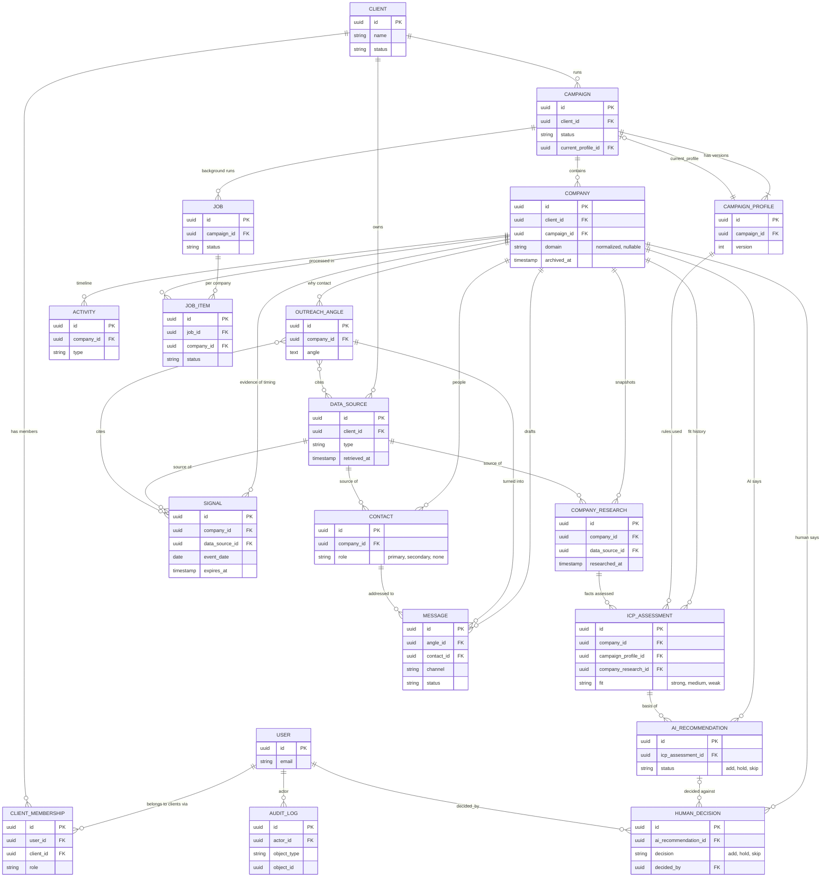

# Data model and entity relationships

Status: draft for team sign-off (issue #38). The model issues #39 to #44 should
not start until this is reviewed. Where this doc and those issue bodies
disagree, the section [Where the sibling issues need adjusting](#where-the-sibling-issues-need-adjusting)
says what to change, and this doc is the proposal to review.

The rules behind it come from the Brief and two accepted ADRs:

- Brief §19: keep historical research instead of overwriting records
  ([ADR 0007](adr/0007-keep-history-and-separate-ai-from-human-decisions.md)).
- Brief §11: the AI recommendation is stored apart from the human decision
  (ADR 0007).
- Brief §2: ICP Fit and Trigger are separate concepts, and a company does not
  need a trigger to qualify
  ([ADR 0008](adr/0008-icp-fit-and-trigger-are-separate.md)).
- Brief §5 and §22: evidence carries a source and a date, and nothing is
  invented.
- Conventions for tenancy, "current" lookups and immutability are in
  [ADR 0009](adr/0009-data-model-conventions.md).

## Contents

1. [The picture](#the-picture)
2. [Ground rules](#ground-rules)
3. [Entities](#entities)
4. [Relationships and cardinalities](#relationships-and-cardinalities)
5. [Tenancy: how data stays inside a client](#tenancy-how-data-stays-inside-a-client)
6. [History: append-only and "current"](#history-append-only-and-current)
7. [Evidence and provenance](#evidence-and-provenance)
8. [Trigger freshness](#trigger-freshness)
9. [Indexes and uniqueness](#indexes-and-uniqueness)
10. [Archive and delete rules](#archive-and-delete-rules)
11. [Where the sibling issues need adjusting](#where-the-sibling-issues-need-adjusting)
12. [Open questions](#open-questions)

## The picture

GitHub renders this diagram. It shows keys and the fields that matter for
relationships. The full field lists are in [Entities](#entities).

Reading it in plain words: a Client has Campaigns. A Campaign has a versioned
profile (its ICP rules) and a list of Companies. Everything we learn about a
Company (research, signals, contacts, assessments, recommendations, decisions,
angles, messages, activities) is attached to that Company and is mostly
add-only. Every fact points at a Data Source.

## Ground rules

These apply to every table unless the entity says otherwise.

- **Primary keys** are UUIDs (as #39 already says). Tables also carry
  `created_at` (timestamptz, UTC, set by the database or the service, never
  by the client).
- **Authorship**: `created_by` is a nullable FK to User. Null means the system
  or an AI step did it, and AI-made rows also carry `model_name`,
  `prompt_version` and `schema_version` (ADR 0003, ADR 0007).
- **Enums** are stored as short lowercase strings with a database CHECK
  constraint (Django `TextChoices` plus a constraint), so the allowed values
  below are enforced in Postgres, not only in Python.
- **Lists of short strings** (reasons, concerns, industries, titles) use
  Postgres `text[]`. JSON (`jsonb`) is used only where the shape is truly
  free-form (activity payloads, audit diffs, raw model output).
- **No numeric score** is the core output anywhere (Brief §15). There is no
  `score` column on any assessment.
- **Foreign keys use PROTECT**, not CASCADE. We archive, we do not cascade
  deletes (see [Archive and delete rules](#archive-and-delete-rules)).
- **Times**: `*_at` is a timestamp. `event_date` is a plain date, because
  evidence usually only says "March 2026", not an hour.

Legend for the tables below: `null` means nullable, otherwise NOT NULL. "Append-only"
means rows are inserted and never updated or deleted by application code.

## Entities

These are the 14 objects from Brief §19, plus the Job, JobItem, AuditLog and
ClientMembership tables the M1 issues already call for. No other new objects
are proposed. Brief §16 feedback is stored as an Activity (see Activity).

Every entity below except User, Client, ClientMembership and AuditLog also has
a `client_id` FK to Client. That is the tenancy column (see
[Tenancy](#tenancy-how-data-stays-inside-a-client)) and is not repeated in each
table.

### User (issue #45)

The Django custom user. Email is the login. Mutable (profile, password, active
flag).

| Field | Type | Notes |
| --- | --- | --- |
| id | uuid | PK |
| email | citext, unique | login |
| name | text | |
| is_active | bool | deactivate instead of delete |
| is_admin | bool | global admin sees every client, see open question 1 |
| password | text | Django hash, never copied into audit diffs |
| created_at, last_login | timestamptz, last_login null | |

### ClientMembership (issue #46)

Which users can see which client, and with what role. Mutable, changes are
audited.

| Field | Type | Notes |
| --- | --- | --- |
| user_id | FK User | |
| client_id | FK Client | |
| role | enum | `admin`, `manager`, `reviewer`, `viewer` (decided in #46) |
| archived_at | timestamptz, null | revoking archives the row, granting again restores it |
| created_at, updated_at | timestamptz | |

Unique on (user_id, client_id). The global admin flag is `User.is_superuser`, the client
role lives only here. See [permissions.md](permissions.md).

### Client (issue #39)

Mutable (name, notes, status). Edits are audited.

| Field | Type | Notes |
| --- | --- | --- |
| id | uuid | PK |
| name | text | unique per lower(name) among non-archived |
| notes | text, null | |
| status | enum | `active`, `archived` |
| created_by | FK User, null | |
| created_at, updated_at | timestamptz | |
| archived_at | timestamptz, null | set together with status `archived` |

### Campaign (issue #39)

One client, one ICP rule set (through its profile). Mutable (name, status,
current profile pointer). Edits are audited.

| Field | Type | Notes |
| --- | --- | --- |
| id | uuid | PK |
| client_id | FK Client | |
| name | text | unique per (client, lower(name)) among non-archived |
| status | enum | `draft`, `active`, `archived` |
| current_profile_id | FK CampaignProfile | always one of this campaign's own versions |
| created_by | FK User, null | |
| created_at, updated_at | timestamptz | |
| archived_at | timestamptz, null | |

### CampaignProfile (issue #39), append-only

The campaign's ICP rules (Brief §3). A profile is never edited. Editing the
rules inserts version n+1 and moves the campaign pointer. Old versions stay so
an old assessment can show exactly which rules it used.

| Field | Type | Notes |
| --- | --- | --- |
| id | uuid | PK |
| campaign_id | FK Campaign | |
| client_id | FK Client | tenancy |
| version | int | 1, 2, 3 ... |
| offer | text | |
| countries | text[] | ISO 3166-1 alpha-2, for example `SA` |
| industries | text[] | |
| company_size_min, company_size_max | int, null | employees, CHECK min <= max when both set |
| business_model | enum | `b2b`, `b2c`, `both` (as built in #39: one enum, as the issue and Brief §3 say, instead of an array) |
| excluded_industries | text[] | |
| excluded_company_types | text[] | for example `government` |
| target_departments | text[] | |
| preferred_buyer_titles | text[] | ordered, first is most preferred |
| outreach_languages | text[] | codes such as `en`, `ar` |
| custom_rules | text, null | free-form qualification notes |
| change_note | text, null | why this version was made |
| created_by | FK User, null | |
| created_at | timestamptz | |

Unique on (campaign_id, version). Cloning a campaign copies the current profile
as version 1 of the new campaign.

### Company (issue #40)

The identity of one account inside one campaign. It holds what was entered or
imported. Researched facts live in CompanyResearch, so correcting a fact is a new
snapshot, not an edit here. Only `status` and `archived_at` change.

| Field | Type | Notes |
| --- | --- | --- |
| id | uuid | PK |
| client_id | FK Client | tenancy |
| campaign_id | FK Campaign | |
| name | text | as entered |
| website | text, null | as entered |
| domain | text, null | normalized, see below |
| profile_url | text, null | company profile URL (Brief §4) |
| country | text, null | ISO alpha-2 |
| input_source | enum | `manual`, `csv`, `provider` |
| status | enum | `pending`, `analyzing`, `analyzed`, `failed` (proposed, see open question 6) |
| created_by_job_id | FK Job, null | the import job, if any |
| created_by | FK User, null | |
| created_at | timestamptz | |
| archived_at | timestamptz, null | |

Domain normalization (one function, used on every write): take the host from
`website`, lowercase it, drop scheme, port, path, a leading `www.` and a
trailing dot, convert IDN to punycode. A company with no website has
`domain` null.

### CompanyResearch (issue #40), append-only

One snapshot of what we knew about the company at one time (Brief §5). A new
research run inserts a new row.

| Field | Type | Notes |
| --- | --- | --- |
| id | uuid | PK |
| company_id | FK Company | |
| data_source_id | FK DataSource | where this snapshot came from |
| researched_at | timestamptz | when the information was retrieved, can be earlier than `created_at` for imports |
| industry | text, null | |
| description | text, null | |
| headquarters | text, null | |
| employee_count | int, null | |
| business_model | text, null | free text, as found |
| classification | enum, null | `b2b`, `b2c`, `both`, `unknown` |
| products_services | text, null | |
| target_customers | text, null | |
| sales_headcount | int, null | |
| bd_headcount | int, null | |
| marketing_headcount | int, null | |
| commercial_partnerships_headcount | int, null | |
| department_growth | jsonb, null | free-form, "where available" |
| headcount_change_3m, headcount_change_6m, headcount_change_12m | numeric(6,2), null | percent, so -12% is `-12.00` |
| created_at | timestamptz | |

Every fact column is nullable because providers return gaps. Null means "not
found", never a guessed value.

### DataSource (issue #41), append-only

Where a piece of evidence came from. See [Evidence and provenance](#evidence-and-provenance).

| Field | Type | Notes |
| --- | --- | --- |
| id | uuid | PK |
| client_id | FK Client | tenancy |
| type | enum | `provider`, `website`, `news`, `manual` |
| name | text | for example the provider name, site or publication |
| url | text, null | required unless type is `manual` or `provider` with no URL |
| provider_reference | text, null | provider's record id, a link to the adapter (ADR 0002) |
| retrieved_at | timestamptz | when we fetched or typed it |
| created_by | FK User, null | |
| created_at | timestamptz | |

### Signal (issue #41), append-only

One trigger-type event for a company (Brief §7). A company can have many. This
is the "Trigger" side of ADR 0008. There is no stored Yes/No, see
[Trigger freshness](#trigger-freshness).

| Field | Type | Notes |
| --- | --- | --- |
| id | uuid | PK |
| company_id | FK Company | |
| data_source_id | FK DataSource, NOT NULL | no source, no signal |
| type | enum | `sales_hiring`, `bd_hiring`, `commercial_hiring`, `partnerships_hiring`, `headcount_growth`, `commercial_team_growth`, `funding`, `market_expansion`, `new_leadership`, `new_office`, `new_product`, `major_partnership`, `other` |
| evidence | text | the supporting text, quoted or summarized from the source |
| event_date | date | when the event happened, NOT NULL (Brief §7 "Date") |
| detected_at | timestamptz | when we found it |
| expires_at | timestamptz, null | null means no expiry rule applied yet (M5) |
| supersedes_id | FK Signal, null | set when this row corrects or replaces an earlier one |
| model_name, prompt_version, schema_version | text, null | null for manual entries |
| created_by | FK User, null | |
| created_at | timestamptz | |

### Contact (issue #41)

A person at the company who may be a buyer (Brief §8). See open question 4:
this is the one table that holds mutable enrichment data.

| Field | Type | Notes |
| --- | --- | --- |
| id | uuid | PK |
| company_id | FK Company | |
| data_source_id | FK DataSource | |
| name | text | |
| title | text, null | |
| profile_url | text, null | |
| email | text, null | |
| email_status | enum | `unknown`, `not_found`, `unverified`, `verified`, `invalid` (proposed, see open question 6) |
| relevance_reason | text | why this person, shown in the card (Brief §15) |
| rank | int, null | 1 is best |
| role | enum | `primary`, `secondary`, `none` |
| created_by | FK User, null | |
| created_at, updated_at | timestamptz | |
| archived_at | timestamptz, null | |

At most one `primary` and one `secondary` per company, enforced by partial
unique indexes on non-archived rows.

### ICPAssessment (issue #42), append-only

The ICP Fit judgement for one company against one version of the campaign
rules. Fit only. No trigger input, no score.

| Field | Type | Notes |
| --- | --- | --- |
| id | uuid | PK |
| company_id | FK Company | |
| campaign_profile_id | FK CampaignProfile | the rule version used |
| company_research_id | FK CompanyResearch | the facts assessed (added, see adjustments) |
| fit | enum | `strong`, `medium`, `weak` |
| reasons | text[] | |
| concerns | text[] | may be empty |
| raw_output | jsonb | the validated structured output, for debugging and prompt work |
| model_name, prompt_version, schema_version | text | |
| created_at | timestamptz | |

### AIRecommendation (issue #42), append-only

What the AI suggests doing. Separate table from the human decision (Brief §11).

| Field | Type | Notes |
| --- | --- | --- |
| id | uuid | PK |
| company_id | FK Company | |
| icp_assessment_id | FK ICPAssessment | the fit this was based on |
| status | enum | `add`, `hold`, `skip` |
| explanation | text | why (Brief §15) |
| model_name, prompt_version, schema_version | text | |
| created_at | timestamptz | |

The recommendation may take current signals into account (a fresh trigger can
tip hold to add), but eligibility never depends on a trigger (ADR 0008).

### HumanDecision (issue #42), append-only

The person's call. Never edited. To change one's mind, add a new decision.

| Field | Type | Notes |
| --- | --- | --- |
| id | uuid | PK |
| company_id | FK Company | |
| ai_recommendation_id | FK AIRecommendation, null | the recommendation this was made against (ADR 0007), see open question 3 |
| decision | enum | `add`, `hold`, `skip` |
| decided_by | FK User | NOT NULL, a human, never null |
| note | text, null | |
| decided_at | timestamptz | |

### OutreachAngle (issue #43), append-only

Why we should contact this account (Brief §9). Stored apart from messages so
one angle can feed LinkedIn, email, WhatsApp and call copy.

| Field | Type | Notes |
| --- | --- | --- |
| id | uuid | PK |
| company_id | FK Company | |
| angle | text | |
| rationale | text | the "because..." (Brief §15) |
| signals | M2M Signal | evidence cited, through `outreach_angle_signals` |
| data_sources | M2M DataSource | evidence cited, through `outreach_angle_sources` |
| model_name, prompt_version, schema_version | text, null | |
| created_by | FK User, null | |
| created_at | timestamptz | |

An angle that cites no evidence is allowed only if it is grounded purely in
campaign rules and research (for example "support the existing BD team"). It
must not cite a signal that does not exist (Brief §12, §22).

### Message (issue #43)

A drafted piece of outreach (Brief §12). The text is immutable. Only workflow
fields change (see open question 5).

| Field | Type | Notes |
| --- | --- | --- |
| id | uuid | PK |
| company_id | FK Company | |
| contact_id | FK Contact | |
| angle_id | FK OutreachAngle | many messages per angle |
| channel | enum | `linkedin`, `email`, `whatsapp`, `call` |
| language | text | code such as `en` or `ar`, must be in the campaign profile's languages |
| subject | text, null | email only |
| body | text | immutable once saved |
| is_followup | bool | |
| status | enum | `draft`, `approved`, `exported` |
| approved_by | FK User, null | set with `approved_at` |
| approved_at, exported_at | timestamptz, null | |
| supersedes_id | FK Message, null | an edited message is a new row pointing at the old |
| model_name, prompt_version, schema_version | text, null | |
| created_by | FK User, null | |
| created_at | timestamptz | |

A message can only be created or approved if the company's latest human
decision is `add` (ADR 0007: outreach starts only from an approved human
decision). CHECK: status `approved` or `exported` requires `approved_by`.

### Activity (issue #43), append-only

The timeline shown on the account detail page (Brief §14), also the home for
Brief §16 feedback.

| Field | Type | Notes |
| --- | --- | --- |
| id | uuid | PK |
| company_id | FK Company | |
| campaign_id | FK Campaign | for per-campaign timelines |
| type | enum | `researched`, `recommended`, `decided`, `contacted`, `replied`, `meeting_booked`, `exported`, `feedback` |
| actor_id | FK User, null | null for system or AI |
| payload | jsonb | small, type-specific, see below |
| created_at | timestamptz | the time it happened |

For `feedback`, the payload carries `kind` (one of `wrong_buyer`, `not_b2b`,
`unsuitable_industry`, `not_a_trigger`, `ceo_should_be_primary`,
`ceo_should_not_be_primary`, `government_company`, `incorrect_company_data`,
`other`), an optional `target` (`{"type": "signal", "id": "..."}`) and a `note`.
Those kinds are the list in Brief §16. If feedback later needs richer querying
it can graduate to its own table (open question 7).

### Job (issue #44)

A background run such as a CSV import or a bulk analysis (Brief §22). Mutable
while it runs (status and counts), by nature.

| Field | Type | Notes |
| --- | --- | --- |
| id | uuid | PK |
| client_id | FK Client | |
| campaign_id | FK Campaign | |
| type | text | a registered job name in code, for example `analyze_company`, `import_csv` |
| status | enum | `queued`, `running`, `succeeded`, `partial`, `failed` |
| total_count, done_count, failed_count | int | |
| error_summary | text, null | |
| queue_task_id | text, null | Django-Q2 task id (ADR 0005) |
| created_by | FK User, null | |
| created_at, started_at, finished_at | timestamptz, last two null | |

### JobItem (issue #44)

Per-company status inside a bulk Job, so one failure does not fail the run.
Mutable like Job.

| Field | Type | Notes |
| --- | --- | --- |
| id | uuid | PK |
| job_id | FK Job | |
| client_id | FK Client | |
| company_id | FK Company | |
| status | enum | `queued`, `running`, `succeeded`, `failed` |
| error | text, null | |
| started_at, finished_at | timestamptz, null | |

Unique on (job_id, company_id).

As built (issue #44): until the Company model exists the item points at its subject with
`subject_type` + `subject_id` (`company` and the company id), unique on
`(job_id, subject_type, subject_id)`, and has an optional JSON `result`. A Job also keeps
`attempts`, and a retry waiting for its backoff is `queued` again (there is no `retrying`
status). The `AuditLog` also stores `request_id`.

### AuditLog (issue #44), append-only

Who changed Client, Campaign, ClientMembership and similar configuration, and
what changed (Brief §15: we need to understand and correct the system). Not
used for research data, which keeps its own history.

| Field | Type | Notes |
| --- | --- | --- |
| id | uuid | PK |
| actor_id | FK User, null | null for system |
| client_id | FK Client, null | set whenever the object belongs to a client, used for scoping |
| action | enum | `create`, `update`, `archive`, `restore`, `delete` |
| object_type | text | for example `campaign` |
| object_id | uuid | |
| before, after | jsonb, null | field-level diff, never includes passwords, tokens or API keys |
| created_at | timestamptz | |

## Relationships and cardinalities

| From | To | Cardinality | Notes |
| --- | --- | --- | --- |
| Client | Campaign | 1 to many | |
| Client | ClientMembership | 1 to many | |
| User | ClientMembership | 1 to many | a user can work on several clients |
| Campaign | CampaignProfile | 1 to many (1 or more) | at least one from creation |
| Campaign | CampaignProfile (current) | 1 to 1 | pointer, always its own version |
| Campaign | Company | 1 to many | a company belongs to exactly one campaign |
| Company | CompanyResearch | 1 to many | |
| Company | Signal | 1 to many (0 or more) | zero is valid: strong fit with no signals |
| Company | Contact | 1 to many (0 or more) | |
| Company | ICPAssessment | 1 to many | each ties to one profile version and one research snapshot |
| ICPAssessment | AIRecommendation | 1 to many | usually one, a re-run may add more |
| AIRecommendation | HumanDecision | 1 to many (0 or more) | none yet means "needs review" |
| Company | HumanDecision | 1 to many | latest wins |
| Company | OutreachAngle | 1 to many | |
| OutreachAngle | Message | 1 to many | |
| Contact | Message | 1 to many | |
| OutreachAngle | Signal, DataSource | many to many | evidence cited |
| DataSource | CompanyResearch, Signal, Contact | 1 to many | each fact has exactly one source |
| Company | Activity | 1 to many | |
| Campaign | Job | 1 to many | |
| Job | JobItem | 1 to many | |
| Company | JobItem | 1 to many | one per job |
| Signal | Signal (supersedes) | 1 to 0 or 1 | correction chain |
| Message | Message (supersedes) | 1 to 0 or 1 | edit chain |

Nothing links ICPAssessment to Signal on purpose. Fit is judged without
timing (ADR 0008). Trigger and fit meet only at the review card and in the
AI recommendation's explanation.

## Tenancy: how data stays inside a client

The rule: **every row is reachable to exactly one Client, and every query that
a user can trigger is filtered by the clients that user may see.** This is what
makes the M1 exit criterion "two clients coexist with no data leaking" true.

How:

1. **Every tenant table has a direct `client_id` FK.** That covers every table
   except User (global), Client (it is the tenant) and ClientMembership /
   AuditLog (which carry their own client link). A direct column means a scoped
   query is a single `WHERE client_id IN (...)`, not a four-table join that
   someone can forget.
2. **Company belongs to one Campaign, which belongs to one Client.** The
   company's `client_id` is copied from its campaign when the row is created.
   Child rows copy `client_id` from their company. The copy is set in one place
   (a shared base model or a service helper), never typed by callers.
3. **A consistency test (issue #53) walks every FK.** For each row it checks
   `child.client_id == parent.client_id`. If anyone writes a row with a
   mismatched client, a test fails. Django has no composite foreign keys, so
   this is checked in code and tests rather than by the database (open
   question 2).
4. **Default scoped manager.** Tenant models use a manager with
   `for_user(user)`: global admins get everything, others get rows whose
   `client_id` is in their ClientMembership rows. Views and services use this
   manager. A raw `Model.objects.all()` in an API view is a review red flag.
5. **Cross-client access returns 404, not 403** (issue #46), so ids cannot be
   probed.
6. **Background jobs carry their client.** A Job stores `client_id` and
   `campaign_id`, and tasks load data through the same scoped lookups using
   that client, not an ambient user.
7. **No cross-client dedupe, ever.** The same website can be a Company in two
   clients' campaigns. They are two rows with separate research and never
   share a record. Strategy and research for one client must not be visible
   to another, even if the company is the same.

## History: append-only and "current"

Which things are history and which are working state:

| Object | Behavior | "Current" is |
| --- | --- | --- |
| CampaignProfile | append-only, versioned | `Campaign.current_profile_id` (pointer) |
| CompanyResearch | append-only | latest `researched_at`, tie-break `created_at` |
| Signal | append-only | the set of fresh, unsuperseded rows (see below) |
| ICPAssessment | append-only | latest `created_at` per company |
| AIRecommendation | append-only | latest `created_at` per company |
| HumanDecision | append-only | latest `decided_at` per company |
| OutreachAngle | append-only | latest `created_at` per company |
| Message | text append-only, status moves forward | latest non-superseded per (angle, contact, channel, is_followup) |
| Activity | append-only | n/a, it is a timeline |
| AuditLog | append-only | n/a |
| Contact | mutable enrichment, see open question 4 | non-archived rows |
| Client, Campaign, Company(status), ClientMembership, Job, JobItem, User | mutable working state | the row itself |

Decision on the "current" marker (also in ADR 0009): for append-only tables we
**do not store an `is_current` flag**. We find the latest row with a query,
through one manager method per model such as
`CompanyResearch.objects.latest_for(company)`. Reasons: a flag means updating
the old row when adding a new one, which breaks "append-only" and creates a
two-writes race; a latest-by-timestamp query is correct by construction and the
indexes in [Indexes](#indexes-and-uniqueness) make it cheap. Ordering is
`(timestamp desc, id desc)`. The one exception is the campaign profile, which
uses a pointer because "current rules" is an explicit choice by a person, and
it is cheap to read from the campaign.

Time to use, per table: `researched_at` for research, `decided_at` for
decisions, `created_at` everywhere else. A backfilled or imported row sets its
own `researched_at`. If an older snapshot is imported later it does not
silently become current if its `researched_at` is older.

Derived views the product needs, all built from the above and not stored:

- **Current account state** = latest research, latest assessment, latest
  recommendation, latest human decision, fresh signals, non-archived contacts.
- **Human status** (dashboard column) = the `decision` of the latest human
  decision, or "needs review" when there is no decision after the latest
  recommendation.
- **Trigger Yes/No** = does the company have at least one fresh signal.
- **Outreach status** (dashboard) = from the latest Activity of type
  `contacted`, `replied`, `meeting_booked`, and from Message status.
- **AI vs human agreement** = join each human decision to the recommendation it
  references.

Corrections are new rows. A wrong signal is superseded by a new signal row
(and a `feedback` activity), not edited or deleted. If a fresh signal is simply
wrong and nothing replaces it, the correction row is a signal of type `other`
with `supersedes_id` set and `expires_at` equal to `created_at` (it expires
immediately). See open question 8 for a cleaner way, if the team prefers.

Every `*_at` for fresh and stale logic is evaluated at query time against the
database clock, so nothing has to run to keep "current" correct.

## Evidence and provenance

Brief §5 says "store source and date for important evidence". The model:

- **DataSource** says where something came from and when we got it: `type`,
  `name`, `url`, `provider_reference`, `retrieved_at`. A new fetch inserts a new
  DataSource row. The same URL fetched twice is two rows, which is correct,
  because the page may have changed.
- **Which date is which** (three different questions, three fields):
  - `DataSource.retrieved_at`: when we fetched it.
  - `Signal.event_date`: when the event happened, the "Date" in Brief §7.
  - `CompanyResearch.researched_at`: when the snapshot was taken.
- **Every fact points at a source.** CompanyResearch, Signal and Contact each
  have a `data_source_id`. Signal's is NOT NULL. For Signal that is the
  database enforcing "no fabricated evidence" (Brief §22).
- **Manual entry is a source too.** A person typing a fact makes a DataSource
  of type `manual` with themself as `created_by`. That keeps one uniform path,
  and "who said so" stays answerable.
- **Angles and messages cite, they do not copy.** OutreachAngle links to the
  Signals and DataSources it relies on. Messages must only use facts reachable
  through their angle or the company's research.
- **AI output is not a source.** A model's inference is recorded on the row
  that holds it (`model_name`, `prompt_version`, `raw_output`), but a Signal
  must cite a real DataSource, so a model cannot be its own evidence.
- **Per-field provenance is not modeled.** One snapshot has one `data_source_id`.
  If one run combines several providers, the primary one is recorded. See open
  question 9.

## Trigger freshness

Brief §7 and ADR 0008: multiple triggers, with freshness so stale events do not
stay current. In the schema:

- Each Signal has `event_date`, `detected_at` and `expires_at`.
- **Fresh** means `expires_at IS NULL OR expires_at > now()`, and nothing
  supersedes the row (no other Signal has `supersedes_id` equal to this id).
- **No stored Yes/No and no `active` flag.** An `active` boolean would need to
  be flipped by a scheduled job, which means mutating an append-only row and a
  window where it is wrong. The Trigger answer is computed: Yes if at least one
  fresh signal exists, else No. A company with no signals is simply "No", and
  that never affects ICP Fit or eligibility (Brief §2).
- `expires_at` is set when the signal is written, from a per-type freshness
  rule: `expires_at = event_date + freshness window for the type`. The rule
  table and the code that applies it are M5 (#41 says the same). Until
  then, `expires_at` is null, meaning "no rule applied yet", and the signal
  counts as fresh. This is deliberate, so M2 to M4 can store signals without
  waiting.
- If a rule changes later, we do not rewrite old rows. New signals get the new
  windows. Re-evaluation of stale ones is a query, not a migration.
- A scheduled re-check job (ADR 0008 consequences) is not required for
  correctness here, because freshness is evaluated at read time. It may still
  be used later to refresh data.

## Indexes and uniqueness

Suggestions for the model issues. All names are examples.

**Uniqueness and integrity**

| Table | Constraint |
| --- | --- |
| Client | unique `lower(name)` where `archived_at IS NULL` |
| Campaign | unique `(client_id, lower(name))` where `archived_at IS NULL` |
| CampaignProfile | unique `(campaign_id, version)`; CHECK `company_size_min <= company_size_max` |
| Campaign | `current_profile_id` must belong to the same campaign (as built in #39: NOT NULL, deferred FK so campaign and v1 are inserted together with a pre-generated profile id; on PostgreSQL a deferred composite FK `(id, current_profile_id)` to `(campaign_id, id)` enforces the same-campaign rule in the database; SQLite relies on `create_profile_version`, `Campaign.clean` and tests) |
| Company | unique `(campaign_id, domain)` where `domain IS NOT NULL` |
| Company | non-unique index on `(campaign_id, lower(name))` to warn about likely duplicates with no domain |
| Signal | `data_source_id` NOT NULL, `event_date` NOT NULL |
| Contact | unique `(company_id, role)` where `role IN ('primary','secondary') AND archived_at IS NULL` |
| Contact | unique `(company_id, profile_url)` where `profile_url IS NOT NULL AND archived_at IS NULL`, to stop the same person being added twice |
| ClientMembership | unique `(user_id, client_id)` |
| JobItem | unique `(job_id, company_id)` |
| All enums | CHECK constraint with the exact values listed above |
| Message | CHECK `status = 'draft' OR approved_by_id IS NOT NULL` |

**Company dedupe by normalized domain, per campaign.** This is #40's rule,
kept. What happens on a duplicate:

- CSV or API import: the import code looks up `(campaign_id, domain)` first. If
  found, it does not insert, it records the row as "duplicate" in the job
  result, and if that existing company is archived it restores it.
- Manual entry: the UI says "this company is already in this campaign" and links
  to it.
- No domain (only a name or profile URL): the row is allowed, the app warns
  when a same-name company exists, a person decides. We do not auto-merge by
  name, because names collide.
- The same domain in a different campaign of the same client is allowed
  (different ICP rules, different assessments), and the UI can show "also in
  campaign X" from the non-unique index `(client_id, domain)`.

**Lookups (latest-per-company)**

| Table | Index |
| --- | --- |
| CompanyResearch | `(company_id, researched_at desc, id desc)` |
| ICPAssessment | `(company_id, created_at desc, id desc)` |
| AIRecommendation | `(company_id, created_at desc, id desc)` |
| HumanDecision | `(company_id, decided_at desc, id desc)` and `(ai_recommendation_id)` |
| OutreachAngle | `(company_id, created_at desc)` |
| Signal | `(company_id, expires_at)` and `(supersedes_id)` |
| Activity | `(company_id, created_at desc)` and `(campaign_id, type, created_at desc)` |
| Message | `(company_id, status)`, `(angle_id)`, `(contact_id)` |
| ICPAssessment | `(campaign_profile_id)` to answer "which assessments used rules v2" |

**Tenancy and dashboard**

| Table | Index |
| --- | --- |
| every tenant table | `(client_id)`, or `(client_id, created_at)` for the large ones |
| Company | `(campaign_id, status)`, `(campaign_id, archived_at)` |
| Job | `(campaign_id, created_at desc)`, `(status)` |
| AuditLog | `(object_type, object_id, created_at desc)`, `(client_id, created_at desc)` |

At V1 volume (hundreds to low thousands of companies per campaign) this is
plenty. Use `DISTINCT ON (company_id)` or a lateral join for the dashboard's
latest-per-company columns. Do not add materialized views until measured.

## Archive and delete rules

- **Client, Campaign, Company, Contact** are archived, not deleted: set
  `archived_at` (and `status = 'archived'` for Client and Campaign). Archived
  rows stay in the database, are hidden from default lists, and keep their
  history readable.
- **Archiving a Client or Campaign does not cascade** to children by writing to
  them. The children are hidden because their parent is archived, and a scoped
  query excludes them unless asked for. A campaign under an archived client
  cannot be set active. Restoring is clearing `archived_at` and setting status
  back.
- **Archived campaigns are read-only**: no new companies, no new jobs, no new
  decisions. Existing data stays viewable to people with access.
- **Append-only records are never soft-deleted.** They have no `archived_at`.
  A bad one is corrected with a newer record (ADR 0007), a bad signal with a
  superseding row.
- **Hard delete** is allowed only for privacy or legal requests, and only
  through a documented admin procedure, never through the normal API. It must
  write an AuditLog entry that holds no personal data (type, id, reason, who).
  Deleting a Contact for privacy should erase the personal fields (name,
  title, email, profile URL) and keep the row's id so Messages and Activities
  that reference it still resolve. This is how PROTECT FKs keep working.
- **Archiving a Client** requires an active-job check: no running Jobs.
- **Users** are deactivated, never deleted, so `created_by` and `decided_by`
  history stays intact.

## Where the sibling issues need adjusting

The issue bodies are good starting points. These are the differences and
proposed changes. Each should be applied when someone picks the issue up.

**#39 (Client, Campaign, CampaignProfile)**
- Make CampaignProfile explicitly immutable (no UPDATE), with `version`, unique
  on `(campaign_id, version)`, plus `created_by` and an optional `change_note`.
- `Campaign.current_profile` is a deferrable FK so a campaign and its v1 can be
  created in one transaction, and must be validated as one of its own versions.
- Add `archived_at` next to `status` for Client and Campaign, and a unique name
  rule per client.
- Give CampaignProfile a `client_id` column (tenancy, see above).
- Decide enum values for Client status (`active`, `archived`).
- Use ISO country codes in `countries`.

**#40 (Company, CompanyResearch)**
- Replace "an `is_current` marker or latest-by-date" with latest-by-timestamp
  only (ADR 0009). No `is_current` column.
- Add `client_id` to Company and CompanyResearch.
- Specify the domain normalization function (above) and the partial unique
  index `(campaign_id, domain) WHERE domain IS NOT NULL`. "Soft handling for
  missing domains" means a warning on same-name companies, nothing automatic.
- Add `archived_at` to Company and a nullable `created_by_job_id`.
- Spell out the department headcount columns and the 3/6/12 month changes as
  percent numerics.
- State that `researched_at` is when the data was retrieved, and that the
  "current" snapshot is ordered by it.
- Duplicate handling: reject at the database, restore if archived, report as
  duplicate in the import.

**#41 (Signal, Contact, DataSource)**
- **Drop the Signal `active flag`.** It conflicts with append-only and with
  freshness evaluated at read time. Replace it with `supersedes_id`. Fresh =
  `expires_at` null or in the future and not superseded.
- Use the Brief §7 type list: the issue's "funding, hiring, leadership,
  expansion, new product, partnership" collapses the four hiring kinds and
  headcount growth into one. Use the thirteen values in Signal above.
- `event_date` NOT NULL, `data_source_id` NOT NULL. Both are enforced by the
  database, not just validators.
- DataSource gets `client_id`, is append-only, and `retrieved_at` NOT NULL.
- Contact needs `client_id`, a `data_source_id` FK, `archived_at`, and the
  partial unique indexes for one primary and one secondary.
- Define `email_status` values (proposal above).

**#42 (ICPAssessment, AIRecommendation, HumanDecision)**
- Add `company_research_id` to ICPAssessment, so an assessment says which
  facts it judged, as well as which rules.
- AIRecommendation links to its assessment, NOT NULL, as the issue says.
- **Add `ai_recommendation_id` to HumanDecision.** The issue omits it, but ADR 0007
  requires "the human decision references the recommendation it was made
  against". Without it, agreement cannot be measured.
- Keep `reasons`, `concerns` as `text[]`. Add `raw_output` jsonb for the
  validated structured output.
- Add `client_id`, and `model_name`, `prompt_version`, `schema_version`
  (ADR 0007) to the AI rows. The issue only names "model/prompt version" on
  ICPAssessment.
- Add the recommended latest-per-company indexes.
- The test "strong fit and no signals is valid" should also check that no
  database constraint or model validation mentions signals.

**#43 (OutreachAngle, Message, Activity)**
- #38 lists Message as append-only but #43 gives it `status` and
  `approved_by`. Resolve as: text is immutable, status and approval move
  forward, an edit is a new row with `supersedes_id`.
- "Evidence references" on OutreachAngle should be two M2M tables (signals,
  data sources), not a free JSON list, so foreign keys keep them honest.
- Message `contact` is NOT NULL, `language` must be one of the campaign
  profile's languages, and creating or approving a message requires the latest
  human decision to be `add` (service rule, plus a test).
- Add `client_id` and `campaign_id` to Activity, and say Activity is
  append-only. Specify the `feedback` payload shape (above) so Brief §16
  feedback has a home with no new table.
- The helper should be one function, for example
  `log_activity(company, type, actor=None, **payload)`.
- Add the model fields `model_name`, `prompt_version`, `schema_version` to
  AI-generated angles and messages.

**#44 (Job, AuditLog)**
- Treat JobItem as required for bulk analysis, not optional. "Failed items do
  not fail the whole job record" and the `partial` status need per-company
  results.
- Add `client_id` to Job and JobItem and `client_id` to AuditLog (nullable) so
  logs can be scoped.
- AuditLog diffs must never contain secrets (password hashes, tokens, provider
  keys).
- Audit CampaignProfile creation as a reference to the new version, not a copy
  of the whole row, and include ClientMembership changes in the audit scope.
- Job `type` is a registered name in code, not free user input.

**#45 and #46 (user, roles)**
- #45 puts a `role` on the User, #46 puts a `role` on ClientMembership. Pick
  one meaning for each: a global admin flag on User (sees every client), and the
  client-specific role on ClientMembership. See open question 1.
- Every tenant model (all those above) must use the scoped manager from #46,
  and the tenant-isolation tests in #53 should enumerate the models so a new
  table cannot be forgotten.

**#47 to #54 (API, UI, seed, tests, admin)**
- Seed (#52): create the SkyLight profile as version 1 and create at least two
  clients so isolation tests have something to fail on.
- Tests (#53): add the client-consistency walk, the append-only guard (UPDATE
  and DELETE on append-only models raise), and the "latest" manager tests.
- Admin (#54): append-only models should be read-only in the admin, with an
  "add" form where it makes sense, no edit or delete.

## Open questions

Numbered so they can be answered in review.

1. **Roles.** Is there a global admin (all clients) plus per-client roles
   (`manager`, `reviewer`, `viewer`), or can a person also be an admin of one
   client only? This doc assumes a global admin flag on User and the other
   roles on ClientMembership.
2. **Client consistency.** Is a test-and-service-layer check enough to keep
   `client_id` equal down the chain, or do we want a database trigger as
   a second line of defense? Django has no composite FKs.
3. **Can a human decide before the AI has run?** If yes,
   `HumanDecision.ai_recommendation_id` stays nullable (as written). If every
   decision must follow a recommendation, make it NOT NULL.
4. **Contact history.** Contacts are mutable here (email and rank change after
   enrichment and verification). Is that acceptable, with changes visible via
   Activity, or do we want ranking and email results stored as history too
   (which adds a ContactRanking or snapshot table)? Brief §19 only requires
   research history.
5. **Message edits.** Is "edited text is a new row, workflow status can move
   forward" the right reading of "Messages are append-only"?
6. **Enum values the Brief does not define.** `Company.status`
   (`pending`, `analyzing`, `analyzed`, `failed`), `Contact.email_status`
   (`unknown`, `not_found`, `unverified`, `verified`, `invalid`) and
   Job `type` names are proposals. Confirm or replace them.
7. **Feedback.** Is an Activity with a `feedback` payload enough for Brief §16,
   or will rule and prompt tuning need a dedicated Feedback table with its own
   foreign keys and review state?
8. **Retiring a wrong signal.** Superseding with an immediately-expired row
   works but is a little clumsy. Alternative: a small append-only
   `SignalRetraction` record. Preference?
9. **Per-field provenance.** One source per research snapshot is simple. If a
   snapshot mixes several providers, do we need a source per field or a M2M of
   sources per snapshot?
10. **Dates for signals.** `event_date` is required. Some evidence (an open job
    post) has no event date, only a posting date. Do we use the posting date,
    or allow a null date with a flag? The no-invention rule says the date
    must come from the source.
11. **Domain rules.** Do we strip subdomains to the registrable domain
    (`eu.example.com` to `example.com`)? This doc only strips `www.`. A public
    suffix list would be needed for the other approach.
12. **Industries and countries.** Free text or a fixed taxonomy for
    `industries`, `excluded_industries` and research `industry`? Free text is
    assumed, with the risk that matching is fuzzy.
13. **Languages.** Is `ar` enough, or do we need a dialect code for "Saudi
    conversational Arabic" (Brief §12), for example a separate `dialect` field?
14. **Retention.** How long do we keep old research and personal data, and who
    runs a privacy deletion? ADR 0007 flags this as unresolved.
15. **Missing provider facts.** If a provider returns an employee count as a
    range, do we store min and max, or only a number? Currently only an int.
