# Data model and entity relationships

Status: final for M1, as implemented (design written in #38, built in #39 to #46, #52). It
describes the schema that is in `backend/apps/*/models.py`, not a proposal. Three parts are
generated from the models and checked by a test, so they cannot drift: the ER diagram, the
entity index and the [field reference](data-model-reference.md) (regenerate with
`python manage.py print_schema --write`, see [Keeping this doc in sync](#keeping-this-doc-in-sync)).
Where the first design changed while building, [Decisions and deviations](#decisions-and-deviations)
says what and why.

The rules behind it come from the Brief and the accepted ADRs:

- Brief §19: keep historical research instead of overwriting records
  ([ADR 0007](adr/0007-keep-history-and-separate-ai-from-human-decisions.md)).
- Brief §11: the AI recommendation is stored apart from the human decision
  (ADR 0007).
- Brief §2: ICP Fit and Trigger are separate concepts, and a company does not
  need a trigger to qualify
  ([ADR 0008](adr/0008-icp-fit-and-trigger-are-separate.md)).
- Brief §5 and §22: evidence carries a source and a date, and nothing is
  invented.
- Conventions for tenancy, "current" lookups and immutability are in
  [ADR 0009](adr/0009-data-model-conventions.md).

## Contents

1. [The picture](#the-picture)
2. [Ground rules](#ground-rules)
3. [Entities](#entities)
4. [Relationships and cardinalities](#relationships-and-cardinalities)
5. [Tenancy: how data stays inside a client](#tenancy-how-data-stays-inside-a-client)
6. [History: append-only and "current"](#history-append-only-and-current)
7. [Evidence and provenance](#evidence-and-provenance)
8. [Trigger freshness](#trigger-freshness)
9. [Indexes and uniqueness](#indexes-and-uniqueness)
10. [Archive and delete rules](#archive-and-delete-rules)
11. [Decisions and deviations](#decisions-and-deviations)
12. [Decisions on the open questions](#decisions-on-the-open-questions)
13. [Keeping this doc in sync](#keeping-this-doc-in-sync)
14. [How to add a new append-only record type](#how-to-add-a-new-append-only-record-type)
15. [How to add a permission-safe endpoint](#how-to-add-a-permission-safe-endpoint)
16. [Authentication and roles](#authentication-and-roles)

Related: [data-model-reference.md](data-model-reference.md) (generated field reference),
[permissions.md](permissions.md) (roles and endpoint rules), [admin.md](admin.md) (Django admin).

## The picture

GitHub renders this diagram. It is generated from the models (see
[Keeping this doc in sync](#keeping-this-doc-in-sync)) and shows relationships, keys and enum
columns. The full field lists are in the [field reference](data-model-reference.md).

```mermaid
erDiagram
    AIRecommendation |o--o{ HumanDecision : "ai_recommendation"
    Campaign |o--o{ Job : "campaign"
    Campaign ||--o{ Activity : "campaign"
    Campaign ||--o{ CampaignProfile : "campaign"
    Campaign ||--o{ Company : "campaign"
    Campaign ||--o{ ImportBatch : "campaign"
    CampaignProfile ||--o{ Campaign : "current_profile"
    CampaignProfile ||--o{ ICPAssessment : "campaign_profile"
    Client |o--o{ AuditLog : "client"
    Company |o--o{ ImportRow : "company"
    Company ||--o{ AIRecommendation : "company"
    Company ||--o{ Activity : "company"
    Company ||--o{ CompanyResearch : "company"
    Company ||--o{ Contact : "company"
    Company ||--o{ HumanDecision : "company"
    Company ||--o{ ICPAssessment : "company"
    Company ||--o{ Message : "company"
    Company ||--o{ OutreachAngle : "company"
    Company ||--o{ Signal : "company"
    CompanyResearch ||--o{ ICPAssessment : "company_research"
    Contact ||--o{ Message : "contact"
    DataSource ||--o{ AngleSource : "data_source"
    DataSource ||--o{ CompanyResearch : "data_source"
    DataSource ||--o{ Contact : "data_source"
    DataSource ||--o{ MessageSource : "data_source"
    DataSource ||--o{ Signal : "data_source"
    ICPAssessment ||--o{ AIRecommendation : "icp_assessment"
    ImportBatch ||--o{ ImportRow : "batch"
    Job |o--o{ ImportBatch : "job"
    Job ||--o{ JobItem : "job"
    Message |o--o| Message : "supersedes"
    Message ||--o{ MessageSignal : "message"
    Message ||--o{ MessageSource : "message"
    OutreachAngle ||--o{ AngleSignal : "angle"
    OutreachAngle ||--o{ AngleSource : "angle"
    OutreachAngle ||--o{ Message : "angle"
    Signal |o--o| Signal : "supersedes"
    Signal ||--o{ AngleSignal : "signal"
    Signal ||--o{ MessageSignal : "signal"
    User ||--o{ ClientMembership : "user"
    User ||--o{ HumanDecision : "decided_by"
    User {
        uuid id PK
    }
    Campaign {
        uuid id PK
        uuid client_id FK
        text_16 status
        uuid current_profile_id FK
        uuid created_by_id FK
    }
    CampaignProfile {
        uuid id PK
        uuid client_id FK
        uuid campaign_id FK
        text_8 business_model
        uuid created_by_id FK
    }
    Client {
        uuid id PK
        text_16 status
        uuid created_by_id FK
    }
    ClientMembership {
        uuid id PK
        uuid client_id FK
        uuid user_id FK
        text_16 role
    }
    Company {
        uuid id PK
        uuid client_id FK
        uuid campaign_id FK
        text_16 input_source
        text_16 status
        uuid created_by_id FK
    }
    CompanyResearch {
        uuid id PK
        uuid client_id FK
        uuid company_id FK
        uuid data_source_id FK
        text_8 classification
    }
    Contact {
        uuid id PK
        uuid client_id FK
        uuid company_id FK
        uuid data_source_id FK
        text_16 email_status
        text_16 role
        uuid created_by_id FK
    }
    DataSource {
        uuid id PK
        uuid client_id FK
        text_16 type
        uuid created_by_id FK
    }
    AuditLog {
        uuid id PK
        uuid actor_id FK
        uuid client_id FK
        text_16 action
    }
    Job {
        uuid id PK
        uuid client_id FK
        uuid campaign_id FK
        text_16 status
        uuid created_by_id FK
    }
    JobItem {
        uuid id PK
        uuid client_id FK
        uuid job_id FK
        text_16 status
    }
    ImportBatch {
        uuid id PK
        uuid client_id FK
        uuid campaign_id FK
        text_16 source
        text_16 status
        uuid created_by_id FK
        uuid job_id FK
    }
    ImportRow {
        uuid id PK
        uuid client_id FK
        uuid batch_id FK
        text_16 outcome
        uuid company_id FK
    }
    Activity {
        uuid id PK
        uuid client_id FK
        uuid company_id FK
        uuid campaign_id FK
        text_24 type
        uuid actor_id FK
    }
    AngleSignal {
        uuid id PK
        uuid client_id FK
        uuid angle_id FK
        uuid signal_id FK
    }
    AngleSource {
        uuid id PK
        uuid client_id FK
        uuid angle_id FK
        uuid data_source_id FK
    }
    Message {
        uuid id PK
        uuid client_id FK
        uuid company_id FK
        uuid contact_id FK
        uuid angle_id FK
        text_16 channel
        text_16 status
        uuid approved_by_id FK
        uuid supersedes_id FK
        uuid created_by_id FK
    }
    MessageSignal {
        uuid id PK
        uuid client_id FK
        uuid message_id FK
        uuid signal_id FK
    }
    MessageSource {
        uuid id PK
        uuid client_id FK
        uuid message_id FK
        uuid data_source_id FK
    }
    OutreachAngle {
        uuid id PK
        uuid client_id FK
        uuid company_id FK
        uuid created_by_id FK
    }
    AIRecommendation {
        uuid id PK
        uuid client_id FK
        uuid company_id FK
        uuid icp_assessment_id FK
        text_8 status
    }
    HumanDecision {
        uuid id PK
        uuid client_id FK
        uuid company_id FK
        uuid ai_recommendation_id FK
        text_8 decision
        uuid decided_by_id FK
    }
    ICPAssessment {
        uuid id PK
        uuid client_id FK
        uuid company_id FK
        uuid campaign_profile_id FK
        uuid company_research_id FK
        text_8 fit
    }
    Signal {
        uuid id PK
        uuid client_id FK
        uuid company_id FK
        uuid data_source_id FK
        text_32 type
        uuid supersedes_id FK
        uuid created_by_id FK
    }
```

<!-- BEGIN GENERATED: erd (python manage.py print_schema --write) -->

<!-- END GENERATED: erd -->

Reading it in plain words: a Client has Campaigns. A Campaign has a versioned
profile (its ICP rules) and a list of Companies. Everything we learn about a
Company (research, signals, contacts, assessments, recommendations, decisions,
angles, messages, activities) is attached to that Company and is mostly
add-only. Every fact points at a Data Source.

## Ground rules

These apply to every table unless the entity says otherwise.

- **Primary keys** are UUIDs. Tables also carry `created_at` (timestamptz, UTC, set by
  Django or the service, never by the client); mutable tables also carry `updated_at`.
- **Authorship**: `created_by` is a nullable FK to User. Null means the system
  or an AI step did it, and AI-made rows also carry `model_name`,
  `prompt_version` and `schema_version` (ADR 0003, ADR 0007).
- **Enums** are stored as short lowercase strings with a database CHECK
  constraint (Django `TextChoices` plus a constraint), so the allowed values
  below are enforced in Postgres, not only in Python.
- **Lists of short strings** (reasons, concerns, industries, titles) use
  `StringListField`: Postgres `text[]`, or a JSON array in `text` on SQLite (tests). JSON
  (`jsonb`) is used only where the shape is truly free-form (activity payloads, audit diffs,
  raw model output).
- **Empty versus null**: optional text is stored as an empty string, not NULL (Django
  convention), and the tables below call it `text, blank`. NULL is used for facts that were not
  found (research columns), optional dates and numbers, optional foreign keys and `jsonb`.
- **No numeric score** is the core output anywhere (Brief §15). There is no
  `score` column on any assessment.
- **Foreign keys use PROTECT**, not CASCADE. We archive, we do not cascade
  deletes (see [Archive and delete rules](#archive-and-delete-rules)).
- **Times**: `*_at` is a timestamp. `event_date` is a plain date, because
  evidence usually only says "March 2026", not an hour.

Legend for the tables below: `null` means nullable, `blank` means NOT NULL with an empty string
when there is no value, otherwise NOT NULL. "Append-only" means rows are inserted and never
updated or deleted by application code (`apps/core/base.py`; raw SQL is out of its reach).

## Entities

These are the 14 objects from Brief §19, plus Job, JobItem, AuditLog and
ClientMembership (M1), ImportBatch and ImportRow (M2) and four evidence link tables (`AngleSignal`, `AngleSource`,
`MessageSignal`, `MessageSource`, the real tables behind the "cites" relations). Brief §16
feedback is stored as an Activity (see Activity).

The index below is generated from the models. The per-entity sections that follow explain
what each one is for and its rules; the complete, generated list of every column, enum value,
constraint and index is in [data-model-reference.md](data-model-reference.md). If a table in
this page and the reference disagree, the reference is right: fix the table.

<!-- BEGIN GENERATED: index (python manage.py print_schema --write) -->
| Model | App | Behaviour | Table |
| --- | --- | --- | --- |
| User | accounts | mutable | `accounts_user` |
| Campaign | campaigns | mutable, archivable, tenant | `campaigns_campaign` |
| CampaignProfile | campaigns | append-only, tenant | `campaigns_campaignprofile` |
| Client | campaigns | mutable, archivable | `campaigns_client` |
| ClientMembership | campaigns | mutable, archivable, tenant | `campaigns_clientmembership` |
| Company | companies | mutable, archivable, tenant | `companies_company` |
| CompanyResearch | companies | append-only, tenant | `companies_companyresearch` |
| Contact | companies | mutable, archivable, tenant | `companies_contact` |
| DataSource | companies | append-only, tenant | `companies_datasource` |
| AuditLog | core | append-only | `core_auditlog` |
| Job | core | mutable, tenant | `core_job` |
| JobItem | core | mutable, tenant | `core_jobitem` |
| ImportBatch | imports | mutable, tenant | `imports_importbatch` |
| ImportRow | imports | append-only, tenant | `imports_importrow` |
| Activity | outreach | append-only, tenant | `outreach_activity` |
| AngleSignal | outreach | append-only, tenant | `outreach_angle_signals` |
| AngleSource | outreach | append-only, tenant | `outreach_angle_sources` |
| Message | outreach | mutable, tenant | `outreach_message` |
| MessageSignal | outreach | append-only, tenant | `outreach_message_signals` |
| MessageSource | outreach | append-only, tenant | `outreach_message_sources` |
| OutreachAngle | outreach | append-only, tenant | `outreach_outreachangle` |
| AIRecommendation | research | append-only, tenant | `research_airecommendation` |
| HumanDecision | research | append-only, tenant | `research_humandecision` |
| ICPAssessment | research | append-only, tenant | `research_icpassessment` |
| Signal | research | append-only, tenant | `research_signal` |
<!-- END GENERATED: index -->

Every tenant entity (the ones marked `tenant` above) has a direct `client_id` FK to Client.
That is the tenancy column (see [Tenancy](#tenancy-how-data-stays-inside-a-client)) and is
not repeated in each table below. User is global, Client is the tenant itself, and AuditLog
carries a nullable `client_id` of its own.

### User (issue #45)

The Django custom user. Email is the login. Mutable (profile, password, active
flag).

| Field | Type | Notes |
| --- | --- | --- |
| id | uuid | PK |
| email | text(254), unique | login, stored lower-case (CHECK), so lookups are case-insensitive |
| name | text, blank | |
| is_active | bool | deactivate instead of delete |
| is_superuser | bool | the global admin: sees every client, needs no membership (decision 1) |
| is_staff | bool | may sign in to the Django admin; client roles never grant it ([admin.md](admin.md)) |
| password | text(128) | Django hash, never shown in the admin and never copied into audit diffs |
| created_at, updated_at, last_login | timestamptz, last_login null | |

### ClientMembership (issue #46)

Which users can see which client, and with what role. Mutable, changes are
audited.

| Field | Type | Notes |
| --- | --- | --- |
| user_id | FK User | |
| client_id | FK Client | |
| role | enum | `admin`, `manager`, `reviewer`, `viewer` (decided in #46) |
| archived_at | timestamptz, null | revoking archives the row, granting again restores it |
| created_at, updated_at | timestamptz | |

Unique on (user_id, client_id). The global admin flag is `User.is_superuser`, the client
role lives only here. See [permissions.md](permissions.md).

### Client (issue #39)

Mutable (name, notes, status). Edits are audited.

| Field | Type | Notes |
| --- | --- | --- |
| id | uuid | PK |
| name | text | unique per lower(name) among non-archived |
| notes | text, blank | |
| status | enum | `active`, `archived` |
| created_by | FK User, null | |
| created_at, updated_at | timestamptz | |
| archived_at | timestamptz, null | set together with status `archived` |

### Campaign (issue #39)

One client, one ICP rule set (through its profile). Mutable (name, status,
current profile pointer). Edits are audited.

| Field | Type | Notes |
| --- | --- | --- |
| id | uuid | PK |
| client_id | FK Client | |
| name | text | unique per (client, lower(name)) among non-archived |
| status | enum | `draft`, `active`, `archived` |
| current_profile_id | FK CampaignProfile | always one of this campaign's own versions |
| created_by | FK User, null | |
| created_at, updated_at | timestamptz | |
| archived_at | timestamptz, null | |

### CampaignProfile (issue #39), append-only

The campaign's ICP rules (Brief §3). A profile is never edited. Editing the
rules inserts version n+1 and moves the campaign pointer. Old versions stay so
an old assessment can show exactly which rules it used.

| Field | Type | Notes |
| --- | --- | --- |
| id | uuid | PK |
| campaign_id | FK Campaign | |
| client_id | FK Client | tenancy |
| version | int | 1, 2, 3 ... |
| offer | text | |
| countries | text[] | ISO 3166-1 alpha-2, for example `SA` |
| industries | text[] | |
| company_size_min, company_size_max | int, null | employees, CHECK min <= max when both set |
| business_model | enum | `b2b`, `b2c`, `both` (as built in #39: one enum, as the issue and Brief §3 say, instead of an array) |
| excluded_industries | text[] | |
| excluded_company_types | text[] | for example `government` |
| target_departments | text[] | |
| preferred_buyer_titles | text[] | ordered, first is most preferred |
| outreach_languages | text[] | codes such as `en`, `ar` |
| custom_rules | text, blank | free-form qualification notes |
| change_note | text, blank | why this version was made |
| created_by | FK User, null | |
| created_at | timestamptz | |

Unique on (campaign_id, version). Cloning a campaign copies the current profile
as version 1 of the new campaign.

### Company (issue #40)

The identity of one account inside one campaign. It holds what was entered or
imported. Researched facts live in CompanyResearch, so correcting a fact is a new
snapshot, not an edit here. Only `status` and `archived_at` change.

| Field | Type | Notes |
| --- | --- | --- |
| id | uuid | PK |
| client_id | FK Client | tenancy |
| campaign_id | FK Campaign | |
| name | text | as entered |
| website | text, blank | as entered |
| domain | text, null | normalized, see below |
| profile_url | text, blank | company profile URL (Brief §4) |
| country | text(2), blank | ISO alpha-2, upper case |
| input_source | enum | `manual`, `csv`, `provider` |
| status | enum | `pending`, `analyzing`, `analyzed`, `failed` |
| created_by_job_id | uuid, null | the import job's id, if any (a plain column, not a FK yet) |
| created_by | FK User, null | |
| created_at | timestamptz | |
| archived_at | timestamptz, null | |

Domain normalization (one function, used on every write): take the host from
`website`, lowercase it, drop scheme, port, path, a leading `www.` and a
trailing dot, convert IDN to punycode. A company with no website has
`domain` null.

### CompanyResearch (issue #40), append-only

One snapshot of what we knew about the company at one time (Brief §5). A new
research run inserts a new row.

| Field | Type | Notes |
| --- | --- | --- |
| id | uuid | PK |
| company_id | FK Company | |
| data_source_id | FK DataSource | where this snapshot came from |
| researched_at | timestamptz | when the information was retrieved, can be earlier than `created_at` for imports |
| industry | text, null | |
| description | text, null | |
| headquarters | text, null | |
| employee_count | int, null | |
| business_model | text, null | free text, as found |
| classification | enum, null | `b2b`, `b2c`, `both`, `unknown` |
| products_services | text, null | |
| target_customers | text, null | |
| sales_headcount | int, null | |
| bd_headcount | int, null | |
| marketing_headcount | int, null | |
| commercial_partnerships_headcount | int, null | |
| department_growth | jsonb, null | free-form, "where available" |
| headcount_change_3m, headcount_change_6m, headcount_change_12m | numeric(6,2), null | percent, so -12% is `-12.00` |
| created_at | timestamptz | |

Every fact column is nullable because providers return gaps. Null means "not
found", never a guessed value.

### DataSource (issue #41), append-only

Where a piece of evidence came from. See [Evidence and provenance](#evidence-and-provenance).

| Field | Type | Notes |
| --- | --- | --- |
| id | uuid | PK |
| client_id | FK Client | tenancy |
| type | enum | `provider`, `website`, `news`, `manual` |
| name | text | for example the provider name, site or publication |
| url | text, blank | required (CHECK) unless type is `manual` or `provider` |
| provider_reference | text, blank | provider's record id, a link to the adapter (ADR 0002) |
| retrieved_at | timestamptz | when we fetched or typed it |
| evidence_date | date, null | the date the source itself states (publication or event date), if any |
| created_by | FK User, null | |
| created_at | timestamptz | |

### Signal (issue #41), append-only

One trigger-type event for a company (Brief §7). A company can have many. This
is the "Trigger" side of ADR 0008. There is no stored Yes/No, see
[Trigger freshness](#trigger-freshness).

| Field | Type | Notes |
| --- | --- | --- |
| id | uuid | PK |
| company_id | FK Company | |
| data_source_id | FK DataSource, NOT NULL | no source, no signal |
| type | enum | `sales_hiring`, `bd_hiring`, `commercial_hiring`, `partnerships_hiring`, `headcount_growth`, `commercial_team_growth`, `funding`, `market_expansion`, `new_leadership`, `new_office`, `new_product`, `major_partnership`, `other` |
| evidence | text | the supporting text, quoted or summarized from the source |
| event_date | date | when the event happened, NOT NULL (Brief §7 "Date") |
| detected_at | timestamptz | when we found it |
| expires_at | timestamptz, null | null means no expiry rule applied yet (M5) |
| supersedes_id | FK Signal, null | set when this row corrects or replaces an earlier one |
| model_name, prompt_version, schema_version | text, blank | blank for manual entries |
| created_by | FK User, null | |
| created_at | timestamptz | |

### Contact (issue #41)

A person at the company who may be a buyer (Brief §8). See decision 4:
this is the one table that holds mutable enrichment data.

| Field | Type | Notes |
| --- | --- | --- |
| id | uuid | PK |
| company_id | FK Company | |
| data_source_id | FK DataSource | |
| name | text | |
| title | text, blank | |
| profile_url | text, blank | personal data, hidden from non-superuser staff in the admin |
| email | text, blank | personal data, masked for non-superuser staff in the admin |
| email_status | enum | `unknown`, `not_found`, `unverified`, `verified`, `invalid`; CHECKs: a status beyond unknown/not_found needs an email, `not_found` has none |
| relevance_reason | text | why this person, shown in the card (Brief §15) |
| rank | int, null | 1 is best |
| role | enum | `primary`, `secondary`, `none` |
| erased_at | timestamptz, null | set by `erase_personal_data()`; an erased contact cannot be restored |
| created_by | FK User, null | |
| created_at, updated_at | timestamptz | |
| archived_at | timestamptz, null | |

At most one `primary` and one `secondary` per company, enforced by partial
unique indexes on non-archived rows.

### ICPAssessment (issue #42), append-only

The ICP Fit judgement for one company against one version of the campaign
rules. Fit only. No trigger input, no score.

| Field | Type | Notes |
| --- | --- | --- |
| id | uuid | PK |
| company_id | FK Company | |
| campaign_profile_id | FK CampaignProfile | the rule version used |
| company_research_id | FK CompanyResearch | the facts assessed (added, see adjustments) |
| fit | enum | `strong`, `medium`, `weak` |
| reasons | text[] | |
| concerns | text[] | may be empty |
| raw_output | jsonb | the validated structured output, for debugging and prompt work |
| model_name, prompt_version, schema_version | text | |
| created_at | timestamptz | |

### AIRecommendation (issue #42), append-only

What the AI suggests doing. Separate table from the human decision (Brief §11).

| Field | Type | Notes |
| --- | --- | --- |
| id | uuid | PK |
| company_id | FK Company | |
| icp_assessment_id | FK ICPAssessment | the fit this was based on |
| status | enum | `add`, `hold`, `skip` |
| explanation | text | why (Brief §15) |
| model_name, prompt_version, schema_version | text | |
| created_at | timestamptz | |

The recommendation may take current signals into account (a fresh trigger can
tip hold to add), but eligibility never depends on a trigger (ADR 0008).

### HumanDecision (issue #42), append-only

The person's call. Never edited. To change one's mind, add a new decision.

| Field | Type | Notes |
| --- | --- | --- |
| id | uuid | PK |
| company_id | FK Company | |
| ai_recommendation_id | FK AIRecommendation, null | the recommendation this was made against (ADR 0007), see decision 3 |
| decision | enum | `add`, `hold`, `skip` |
| decided_by | FK User | NOT NULL, a human, never null |
| note | text, blank | |
| decided_at | timestamptz | when the person decided; the "latest" ordering key |
| created_at | timestamptz | tie-break after `decided_at` |

Implementation (#42): all three models live in the `research` app
(`apps/research/models.py`, writes in `services.py`). Differences from the tables
above: `raw_output` is also on AIRecommendation, `created_at` is also on
HumanDecision (tie-break after `decided_at`), and `explanation`, `model_name`,
`prompt_version` and `schema_version` are non-empty by CHECK constraint. Fit,
status and decision are CHECK-constrained enums. There is no numeric field and the
services refuse a `raw_output` that carries a key containing "score".

### OutreachAngle (issue #43), append-only

Why we should contact this account (Brief §9). Stored apart from messages so
one angle can feed LinkedIn, email, WhatsApp and call copy.

| Field | Type | Notes |
| --- | --- | --- |
| id | uuid | PK |
| company_id | FK Company | |
| angle | text | |
| rationale | text | the "because..." (Brief §15) |
| signals | M2M Signal | evidence cited, through `outreach_angle_signals` |
| data_sources | M2M DataSource | evidence cited, through `outreach_angle_sources` |
| model_name, prompt_version, schema_version | text, blank | |
| created_by | FK User, null | |
| created_at | timestamptz | |

An angle that cites no evidence is allowed only if it is grounded purely in
campaign rules and research (for example "support the existing BD team"). It
must not cite a signal that does not exist (Brief §12, §22).

### Message (issue #43)

A drafted piece of outreach (Brief §12). The text is immutable. Only workflow
fields change (see decision 5).

| Field | Type | Notes |
| --- | --- | --- |
| id | uuid | PK |
| company_id | FK Company | |
| contact_id | FK Contact | |
| angle_id | FK OutreachAngle | many messages per angle |
| channel | enum | `linkedin`, `email`, `whatsapp`, `call` |
| language | text | code such as `en` or `ar`, must be in the campaign profile's languages |
| subject | text, blank | email only (CHECK) |
| body | text | immutable once saved |
| is_followup | bool | |
| status | enum | `draft`, `approved`, `exported` |
| approved_by | FK User, null | set with `approved_at` |
| approved_at, exported_at | timestamptz, null | |
| supersedes_id | FK Message, null | an edited message is a new row pointing at the old |
| model_name, prompt_version, schema_version | text, blank | |
| signals, data_sources | M2M | evidence the text uses, through `MessageSignal` and `MessageSource` |
| created_by | FK User, null | |
| created_at | timestamptz | |

A message can only be created or approved if the company's latest human
decision is `add` (ADR 0007: outreach starts only from an approved human
decision). CHECKs: status `approved` or `exported` requires `approved_by` and `approved_at`,
`exported` requires `exported_at`, and `subject` is for email only. Status moves one step
forward (`draft`, `approved`, `exported`); the text columns cannot change after insert.

### Activity (issue #43), append-only

The timeline shown on the account detail page (Brief §14), also the home for
Brief §16 feedback.

| Field | Type | Notes |
| --- | --- | --- |
| id | uuid | PK |
| company_id | FK Company | |
| campaign_id | FK Campaign | for per-campaign timelines |
| type | enum | `researched`, `recommended`, `decided`, `contacted`, `replied`, `meeting_booked`, `exported`, `feedback` |
| actor_id | FK User, null | null for system or AI |
| payload | jsonb | small, type-specific, see below |
| created_at | timestamptz | the time it happened |

For `feedback`, the payload carries `kind` (one of `wrong_buyer`, `not_b2b`,
`unsuitable_industry`, `not_a_trigger`, `ceo_should_be_primary`,
`ceo_should_not_be_primary`, `government_company`, `incorrect_company_data`,
`other`), an optional `target` (`{"type": "signal", "id": "..."}`) and a `note`.
Those kinds are the list in Brief §16. If feedback later needs richer querying
it can graduate to its own table (decision 7).

### Job (issue #44)

A background run such as a CSV import or a bulk analysis (Brief §22). Mutable
while it runs (status and counts), by nature.

| Field | Type | Notes |
| --- | --- | --- |
| id | uuid | PK |
| client_id | FK Client | |
| campaign_id | FK Campaign, null | must belong to the same client |
| type | text | a registered job name in code, for example `analyze_company`, `import_csv` |
| status | enum | `queued`, `running`, `succeeded`, `partial`, `failed` |
| total_count, done_count, failed_count | int | CHECK `done + failed <= total` |
| attempts | smallint | runs started so far |
| error_summary | text, blank | |
| queue_task_id | text, blank | Django-Q2 task id (ADR 0005) |
| created_by | FK User, null | |
| created_at, updated_at, started_at, finished_at | timestamptz, last two null | `finished_at` is set exactly when the status is terminal (CHECK) |

### JobItem (issue #44)

One result row per subject (a company) inside a bulk Job, so one failure does not fail the run.
Mutable like Job until it is terminal.

| Field | Type | Notes |
| --- | --- | --- |
| id | uuid | PK |
| job_id | FK Job | |
| client_id | FK Client | copied from the job |
| subject_type, subject_id | text, uuid | what was processed: `company` and its id (a generic reference) |
| status | enum | `queued`, `running`, `succeeded`, `failed` |
| error | text, blank | |
| result | jsonb, null | small JSON outcome |
| started_at, finished_at | timestamptz, null | `finished_at` is set exactly when terminal (CHECK) |
| created_at, updated_at | timestamptz | |

Unique on (job_id, subject_type, subject_id). A retry that waits for its backoff puts the job
back to `queued` (there is no `retrying` status), and `Job.attempts` counts the runs. To retry a
failed subject, start a new job.

### ImportBatch (issue #56)

One submission of companies into a campaign: a manual entry (one row), a CSV upload or a provider
import (Brief §4, §19). All three open a batch the same way and look the same afterwards.
Mutable working state while it runs; change it only through `apps/imports/services.py`.

| Field | Type | Notes |
| --- | --- | --- |
| id | uuid | PK |
| client_id | FK Client | copied from the campaign |
| campaign_id | FK Campaign | an archived campaign takes no new batch |
| source | enum | `manual`, `csv`, `provider` (same values as `Company.input_source`) |
| status | enum | `pending`, `processing`, `completed`, `partial`, `failed`, `cancelled` |
| original_filename | text, blank | base name only, CSV |
| file_size | bigint, null | bytes, CSV |
| file_sha256 | text, blank | hex digest of the uploaded bytes; required (CHECK) when `source` is `csv`. The file itself is not kept |
| column_mapping | jsonb | free-form: which column fed which company field |
| total_count | int | rows expected; set when known (a CSV after parsing) |
| created_count, duplicate_count, restored_count, skipped_count, failed_count | int | one counter per row outcome; disjoint |
| error_summary | text, blank | first failures, or why the run broke; secrets scrubbed |
| created_by | FK User, null | |
| job_id | FK Job, null | the background run, so a screen can show progress; same client |
| created_at, updated_at, started_at, finished_at | timestamptz, last two null | `finished_at` is set exactly when the status is terminal (CHECK) |

Status moves `pending` -> `processing` -> `completed` / `partial` / `failed` / `cancelled`
(`pending` may also go straight to `failed` or `cancelled`); terminal states do not change, and
`save` refuses an illegal move. `finalize_batch` picks the end state from the counters: no failed
row is `completed`, some failed and some did not is `partial`, every row failed is `failed`.
CHECK: the five counters add up to at most `total_count`. Counters change only under a row lock
(`select_for_update`) in `record_row_outcome`, like `Job` counts.

What may change after creation: `status`, the counters, `total_count`, `started_at`,
`finished_at`, `error_summary`, `job_id` (once), `updated_at`. Everything else is fixed.

### ImportRow (issue #56), append-only

What happened to one submitted company. Written once, with its outcome, in the same transaction
that bumps the batch counter; never updated or deleted. Re-running a row (a redelivered task)
finds it and changes nothing. To retry failed rows, import them again as a new batch.

| Field | Type | Notes |
| --- | --- | --- |
| id | uuid | PK |
| client_id | FK Client | copied from the batch |
| batch_id | FK ImportBatch | |
| row_number | int | 1-based position in the submission (CSV: data rows, header excluded); CHECK `>= 1`; unique per batch |
| raw_data | jsonb | what was submitted. Credentials are never stored: values under keys such as password, token, api key, secret, cookie are `[REDACTED]`, and embedded secrets (bearer tokens, `user:pw@` URLs, JWTs, `key=value`) are scrubbed. Values are cut at 2000 characters and the whole object at 16 KiB (dropped keys are marked `"_truncated": true`). Applied in `ImportRow.save` |
| name, website, domain, profile_url, country | text, blank; domain null | the normalized input (`validate_company_input`); blank when the row was too broken to normalize |
| outcome | enum | `created`, `duplicate`, `restored`, `skipped`, `failed` |
| error_code | text, blank | stable code, required (CHECK) when `failed` (see `apps/imports/schema.py`, plus `company_rejected`, `internal_error`) |
| error_message | text, blank | for people; secrets scrubbed |
| company_id | FK Company, null | the new company, or the existing one for `duplicate` / `restored`; required (CHECK) for those three outcomes; same campaign as the batch |
| created_at | timestamptz | |

The shared input schema (`apps/imports/schema.py`) is the same for manual, CSV and provider:
`name` required (300 chars), optional `website` (http/https or no scheme, a real domain, no
credentials), `profile_url` (absolute http/https, no credentials) and `country` (ISO 3166-1
alpha-2). Errors are field-level with stable codes. No research is triggered by an import.

### AuditLog (issue #44), append-only

Who changed Client, Campaign, ClientMembership and similar configuration, and
what changed (Brief §15: we need to understand and correct the system). Not
used for research data, which keeps its own history.

| Field | Type | Notes |
| --- | --- | --- |
| id | uuid | PK |
| actor_id | FK User, null | null for system |
| client_id | FK Client, null | set whenever the object belongs to a client, used for scoping |
| action | enum | `create`, `update`, `archive`, `restore`, `delete` |
| object_type | text | for example `campaign` |
| object_id | uuid | |
| before, after | jsonb, null | field-level diff, never includes passwords, tokens or API keys (redacted on write and again on display in the admin) |
| request_id | text, blank | the request that caused it |
| created_at | timestamptz | |

## Relationships and cardinalities

| From | To | Cardinality | Notes |
| --- | --- | --- | --- |
| Client | Campaign | 1 to many | |
| Client | ClientMembership | 1 to many | |
| User | ClientMembership | 1 to many | a user can work on several clients |
| Campaign | CampaignProfile | 1 to many (1 or more) | at least one from creation |
| Campaign | CampaignProfile (current) | 1 to 1 | pointer, always its own version |
| Campaign | Company | 1 to many | a company belongs to exactly one campaign |
| Company | CompanyResearch | 1 to many | |
| Company | Signal | 1 to many (0 or more) | zero is valid: strong fit with no signals |
| Company | Contact | 1 to many (0 or more) | |
| Company | ICPAssessment | 1 to many | each ties to one profile version and one research snapshot |
| ICPAssessment | AIRecommendation | 1 to many | usually one, a re-run may add more |
| AIRecommendation | HumanDecision | 1 to many (0 or more) | none yet means "needs review" |
| Company | HumanDecision | 1 to many | latest wins |
| Company | OutreachAngle | 1 to many | |
| OutreachAngle | Message | 1 to many | |
| Contact | Message | 1 to many | |
| OutreachAngle | Signal, DataSource | many to many | evidence cited |
| DataSource | CompanyResearch, Signal, Contact | 1 to many | each fact has exactly one source |
| Company | Activity | 1 to many | |
| Campaign | Job | 1 to many (0 or more) | a job may have no campaign |
| Job | JobItem | 1 to many | |
| Company | JobItem | 1 to many | by `subject_type` + `subject_id`, one per job (not a FK) |
| Campaign | ImportBatch | 1 to many | every way of adding companies opens a batch |
| Job | ImportBatch | 1 to many (0 or more) | the background run that processes the batch, for progress |
| ImportBatch | ImportRow | 1 to many | unique `(batch_id, row_number)` |
| Company | ImportRow | 1 to many (0 or more) | the company a row created, matched or restored |
| Message | Signal, DataSource | many to many | evidence the text uses, through `MessageSignal` / `MessageSource` |
| Signal | Signal (supersedes) | 1 to 0 or 1 | correction chain |
| Message | Message (supersedes) | 1 to 0 or 1 | edit chain |

Nothing links ICPAssessment to Signal on purpose. Fit is judged without
timing (ADR 0008). Trigger and fit meet only at the review card and in the
AI recommendation's explanation.

## Tenancy: how data stays inside a client

The rule: **every row is reachable to exactly one Client, and every query that
a user can trigger is filtered by the clients that user may see.** This is what
makes the M1 exit criterion "two clients coexist with no data leaking" true.

How:

1. **Every tenant table has a direct `client_id` FK.** That covers every table
   except User (global), Client (it is the tenant) and AuditLog (whose nullable
   `client_id` is set when the object belongs to a client). ClientMembership has
   its own `client_id` like the others. A direct column means a scoped
   query is a single `WHERE client_id IN (...)`, not a four-table join that
   someone can forget.
2. **Company belongs to one Campaign, which belongs to one Client.** The
   company's `client_id` is copied from its campaign when the row is created.
   Child rows copy `client_id` from their company. The copy is set in one place
   (a shared base model or a service helper), never typed by callers.
3. **Consistency is checked on every save and in tests.** `TenantModel.sync_client` copies
   `client_id` from the parent, raises `TenantMismatchError` if a caller passes a different one,
   and refuses to move a saved row to another client. Models that also point at another tenant row
   (a data source, a signal) refuse a different client in their own `sync_client`. The invariants
   tests (issue #53) walk every FK and check `child.client_id == parent.client_id`. Django has no
   composite foreign keys, so this is checked in code and tests rather than by the database
   (decision 2).
4. **Default scoped manager.** Tenant models use a manager with
   `for_user(user)`: global admins get everything, others get rows whose
   `client_id` is in their ClientMembership rows. Views and services use this
   manager. A raw `Model.objects.all()` in an API view is a review red flag.
5. **Cross-client access returns 404, not 403** (issue #46), so ids cannot be
   probed.
6. **Background jobs carry their client.** A Job stores `client_id` and
   `campaign_id`, and tasks load data through the same scoped lookups using
   that client, not an ambient user.
7. **No cross-client dedupe, ever.** The same website can be a Company in two
   clients' campaigns. They are two rows with separate research and never
   share a record. Strategy and research for one client must not be visible
   to another, even if the company is the same.

## History: append-only and "current"

Which things are history and which are working state:

| Object | Behavior | "Current" is |
| --- | --- | --- |
| CampaignProfile | append-only, versioned | `Campaign.current_profile_id` (pointer) |
| CompanyResearch | append-only | latest `researched_at`, tie-break `created_at` |
| Signal | append-only | the set of fresh, unsuperseded rows (see below) |
| ICPAssessment | append-only | latest `created_at` per company |
| AIRecommendation | append-only | latest `created_at` per company |
| HumanDecision | append-only | latest `decided_at` per company |
| OutreachAngle | append-only | latest `created_at` per company |
| AngleSignal, AngleSource, MessageSignal, MessageSource | append-only link rows | n/a |
| Message | text immutable, status moves forward | latest non-superseded per (angle, contact, channel, is_followup) (`Message.is_current`) |
| Activity | append-only | n/a, it is a timeline |
| AuditLog | append-only | n/a |
| Contact | mutable enrichment (decision 4) | non-archived rows |
| ImportRow | append-only | n/a, one row per submitted company per batch |
| Client, Campaign, Company(status), ClientMembership, Job, JobItem, ImportBatch, User | mutable working state | the row itself |

Decision on the "current" marker (also in ADR 0009): for append-only tables we
**do not store an `is_current` flag**. We find the latest row with a query,
through one manager method per model such as
`CompanyResearch.objects.latest_for(company)`. Reasons: a flag means updating
the old row when adding a new one, which breaks "append-only" and creates a
two-writes race; a latest-by-timestamp query is correct by construction and the
indexes in [Indexes](#indexes-and-uniqueness) make it cheap. Ordering is
`(timestamp desc, id desc)`. The one exception is the campaign profile, which
uses a pointer because "current rules" is an explicit choice by a person, and
it is cheap to read from the campaign.

Time to use, per table: `researched_at` for research, `decided_at` for
decisions, `created_at` everywhere else. A backfilled or imported row sets its
own `researched_at`. If an older snapshot is imported later it does not
silently become current if its `researched_at` is older.

Derived views the product needs, all built from the above and not stored:

- **Current account state** = latest research, latest assessment, latest
  recommendation, latest human decision, fresh signals, non-archived contacts.
- **Human status** (dashboard column) = the `decision` of the latest human
  decision, or "needs review" when there is no decision after the latest
  recommendation.
- **Trigger Yes/No** = does the company have at least one fresh signal.
- **Outreach status** (dashboard) = from the latest Activity of type
  `contacted`, `replied`, `meeting_booked`, and from Message status.
- **AI vs human agreement** = join each human decision to the recommendation it
  references.

Corrections are new rows. A wrong signal is superseded by a new signal row
(and a `feedback` activity), not edited or deleted. If a fresh signal is simply
wrong and nothing replaces it, `research.services.retire_signal` inserts a
signal of type `other` with `supersedes_id` set and `expires_at` equal to
the time of writing (it expires immediately), decision 8.

Every `*_at` for fresh and stale logic is evaluated at query time against the
database clock, so nothing has to run to keep "current" correct.

## Evidence and provenance

Brief §5 says "store source and date for important evidence". The model:

- **DataSource** says where something came from and when we got it: `type`,
  `name`, `url`, `provider_reference`, `retrieved_at`. A new fetch inserts a new
  DataSource row. The same URL fetched twice is two rows, which is correct,
  because the page may have changed.
- **Which date is which** (three different questions, three fields):
  - `DataSource.retrieved_at`: when we fetched it.
  - `Signal.event_date`: when the event happened, the "Date" in Brief §7.
  - `CompanyResearch.researched_at`: when the snapshot was taken.
- **Every fact points at a source.** CompanyResearch, Signal and Contact each
  have a `data_source_id`. Signal's is NOT NULL. For Signal that is the
  database enforcing "no fabricated evidence" (Brief §22).
- **Manual entry is a source too.** A person typing a fact makes a DataSource
  of type `manual` with themself as `created_by`. That keeps one uniform path,
  and "who said so" stays answerable.
- **Angles and messages cite, they do not copy.** OutreachAngle links to the
  Signals and DataSources it relies on. Messages must only use facts reachable
  through their angle or the company's research.
- **AI output is not a source.** A model's inference is recorded on the row
  that holds it (`model_name`, `prompt_version`, `raw_output`), but a Signal
  must cite a real DataSource, so a model cannot be its own evidence.
- **Per-field provenance is not modeled.** One snapshot has one `data_source_id`.
  If one run combines several providers, the primary one is recorded. See open
  question 9.

## Trigger freshness

Brief §7 and ADR 0008: multiple triggers, with freshness so stale events do not
stay current. In the schema:

- Each Signal has `event_date`, `detected_at` and `expires_at`.
- **Fresh** means `expires_at IS NULL OR expires_at > now()`, and nothing
  supersedes the row (no other Signal has `supersedes_id` equal to this id).
- **No stored Yes/No and no `active` flag.** An `active` boolean would need to
  be flipped by a scheduled job, which means mutating an append-only row and a
  window where it is wrong. The Trigger answer is computed: Yes if at least one
  fresh signal exists, else No. A company with no signals is simply "No", and
  that never affects ICP Fit or eligibility (Brief §2).
- `expires_at` is set when the signal is written, from a per-type freshness
  rule: `expires_at = event_date + freshness window for the type`. The rule
  table and the code that applies it are M5 (#41 says the same). Until
  then, `expires_at` is null, meaning "no rule applied yet", and the signal
  counts as fresh. This is deliberate, so M2 to M4 can store signals without
  waiting.
- If a rule changes later, we do not rewrite old rows. New signals get the new
  windows. Re-evaluation of stale ones is a query, not a migration.
- A scheduled re-check job (ADR 0008 consequences) is not required for
  correctness here, because freshness is evaluated at read time. It may still
  be used later to refresh data.

## Indexes and uniqueness

The exact constraint and index names are generated in the [field reference](data-model-reference.md).
The rules they implement:

**Uniqueness and integrity**

| Table | Rule |
| --- | --- |
| Client | unique `lower(name)` where `archived_at IS NULL` |
| Campaign | unique `(client_id, lower(name))` where `archived_at IS NULL` |
| CampaignProfile | unique `(campaign_id, version)`, version >= 1, CHECK `company_size_min <= company_size_max`, non-empty `offer`; unique `(campaign_id, id)` is the target of the composite FK below |
| Campaign | `current_profile_id` NOT NULL, a deferred FK so campaign and v1 are inserted together with a pre-generated profile id. On PostgreSQL a deferred composite FK `(id, current_profile_id)` to `(campaign_id, id)` enforces "one of its own versions" in the database; SQLite relies on `create_profile_version`, `Campaign.clean` and tests |
| Company | unique `(campaign_id, domain)` where `domain IS NOT NULL` (archived rows count); non-empty `name` |
| Company | non-unique index on `(campaign_id, lower(name))` to warn about likely duplicates with no domain |
| DataSource | CHECK `url` is set unless type is `manual` or `provider` |
| Signal | `data_source_id` NOT NULL, `event_date` NOT NULL, non-empty `evidence`; `supersedes` is one to one |
| Contact | unique `(company_id, role)` where `role IN ('primary','secondary') AND archived_at IS NULL`; unique `(company_id, profile_url)` where the URL is set and the row is not archived; rank >= 1; email and status CHECKs |
| ClientMembership | unique `(user_id, client_id)` |
| JobItem | unique `(job_id, subject_type, subject_id)` |
| ImportRow | unique `(batch_id, row_number)`; CHECK `company_id` set for `created` / `duplicate` / `restored`; CHECK `error_code` set when `failed` |
| ImportBatch | CHECK the five outcome counters add up to at most `total_count`; CHECK a `csv` batch has `file_sha256`; `finished_at` is set exactly when the status is terminal |
| Job | CHECK `done_count + failed_count <= total_count`; `finished_at` is set exactly when the status is terminal |
| ICPAssessment, AIRecommendation | `model_name`, `prompt_version`, `schema_version` non-empty; `AIRecommendation.explanation` non-empty |
| Message | CHECKs: approved or exported needs `approved_by` and `approved_at`; exported needs `exported_at`; `subject` for email only; non-empty body and language |
| Evidence link tables | unique per (angle or message, signal or data source) |
| All enums | CHECK constraint with the exact values listed above |

**Lookups (latest-per-company)**

Each append-only table that has a "current" row has a descending index that serves it:
`CompanyResearch (company, -researched_at, -created_at, -id)`, `ICPAssessment` and
`AIRecommendation (company, -created_at, -id)`, `HumanDecision (company, -decided_at, -created_at,
-id)` plus `(ai_recommendation)`, `OutreachAngle (company, -created_at)`, `Signal (company,
expires_at)`, `Activity (company, -created_at)` and `(campaign, type, -created_at)`,
`Message (company, status)`, `(angle)`, `(contact)`, `ICPAssessment (campaign_profile)`.

**Tenancy and dashboard**

Every tenant table has an index on `client_id` (or `(client, ...)` for the large ones), and
`Company (campaign, status)`, `Company (campaign, archived_at)`, `Job (campaign, -created_at)`,
`Job (status)`, `AuditLog (object_type, object_id, -created_at)` and `(client, -created_at)`.

**Company dedupe by normalized domain, per campaign.** This is #40's rule,
kept. What happens on a duplicate:

- CSV or API import: the import code looks up `(campaign_id, domain)` first. If
  found, it does not insert, it records the row as "duplicate" in the job
  result, and if that existing company is archived it restores it.
- Manual entry: the UI says "this company is already in this campaign" and links
  to it.
- No domain (only a name or profile URL): the row is allowed, the app warns
  when a same-name company exists, a person decides. We do not auto-merge by
  name, because names collide.
- The same domain in a different campaign of the same client is allowed
  (different ICP rules, different assessments), and the UI can show "also in
  campaign X" from the non-unique index `(client_id, domain)`.

**Lookups (latest-per-company)**

| Table | Index |
| --- | --- |
| CompanyResearch | `(company_id, researched_at desc, id desc)` |
| ICPAssessment | `(company_id, created_at desc, id desc)` |
| AIRecommendation | `(company_id, created_at desc, id desc)` |
| HumanDecision | `(company_id, decided_at desc, id desc)` and `(ai_recommendation_id)` |
| OutreachAngle | `(company_id, created_at desc)` |
| Signal | `(company_id, expires_at)` and `(supersedes_id)` |
| Activity | `(company_id, created_at desc)` and `(campaign_id, type, created_at desc)` |
| Message | `(company_id, status)`, `(angle_id)`, `(contact_id)` |
| ICPAssessment | `(campaign_profile_id)` to answer "which assessments used rules v2" |

**Tenancy and dashboard**

| Table | Index |
| --- | --- |
| every tenant table | `(client_id)`, or `(client_id, created_at)` for the large ones |
| Company | `(campaign_id, status)`, `(campaign_id, archived_at)` |
| Job | `(campaign_id, created_at desc)`, `(status)` |
| ImportBatch | `(campaign_id, created_at desc)`, `(client_id, created_at desc)`, `(status)`, `(campaign_id, file_sha256)` |
| ImportRow | `(batch_id, outcome, row_number)`, `(company_id)`, `(client_id)` |
| AuditLog | `(object_type, object_id, created_at desc)`, `(client_id, created_at desc)` |

At V1 volume (hundreds to low thousands of companies per campaign) this is
plenty. Use `DISTINCT ON (company_id)` or a lateral join for the dashboard's
latest-per-company columns. Do not add materialized views until measured.

## Archive and delete rules

- **Client, Campaign, Company, Contact** are archived, not deleted: set
  `archived_at` (and `status = 'archived'` for Client and Campaign). Archived
  rows stay in the database, are hidden from default lists, and keep their
  history readable.
- **Archiving a Client or Campaign does not cascade** to children by writing to
  them. The children are hidden because their parent is archived, and a scoped
  query excludes them unless asked for. A campaign under an archived client
  cannot be set active. Restoring is clearing `archived_at` and setting status
  back.
- **Archived campaigns are read-only**: `create_company` and job creation refuse them, and the
  research and outreach services refuse an archived company or contact. Existing data stays
  viewable to people with access.
- **Append-only records are never soft-deleted.** They have no `archived_at`.
  A bad one is corrected with a newer record (ADR 0007), a bad signal with a
  superseding row.
- **Hard delete** is allowed only for privacy or legal requests, never through the normal
  API or the Django admin (no model there has a delete button). A privacy request on a Contact
  uses `Contact.erase_personal_data()`: it blanks name, title, email, profile URL and reason,
  archives the row and sets `erased_at`, keeping the id so Messages and Activities that reference
  it still resolve (this is how PROTECT FKs keep working). The caller writes an AuditLog entry
  that holds no personal data (type, id, reason, who). There is no admin or API action for it
  yet, and no retention schedule (decision 14).
- **Archiving a Client** is refused while it has queued or running Jobs
  (`ClientHasActiveJobsError`).
- **Users** are deactivated, never deleted, so `created_by` and `decided_by`
  history stays intact.

## Decisions and deviations

What changed between the design in #38 and the schema that was built, so nobody has to compare
the old issue bodies. The generated [reference](data-model-reference.md) is the source of truth
for columns.

| Area | Proposed in #38 | As built |
| --- | --- | --- |
| Global admin | `User.is_admin` | `User.is_superuser` (Django's flag). `is_staff` only controls the Django admin. Client roles live on `ClientMembership` (#45, #46). |
| Email | `citext` unique | `text(254)` unique, stored lower-case with a CHECK (`accounts_user_email_lowercase`), so it works on SQLite and Postgres alike. |
| Optional text | `text, null` | NOT NULL with an empty string (Django convention), shown as `text, blank` below. Only research facts, `jsonb` outputs and dates use NULL, because there "not found" must differ from "empty". |
| `Campaign.current_profile` | deferrable FK, validated in code | NOT NULL, deferred FK; on PostgreSQL a deferred composite FK `(id, current_profile_id)` to `(campaign_id, id)` makes the database enforce "one of its own versions". SQLite relies on the services, `Campaign.clean` and tests (#39). |
| `Company.created_by_job_id` | FK to Job | still a plain nullable UUID (no FK), because jobs are generic. |
| `DataSource` | no evidence date | `evidence_date` (the date the source itself states) next to `retrieved_at` (#40). |
| `Contact` | mutable enrichment | adds `erased_at` and `erase_personal_data()` for privacy requests, plus CHECKs tying `email_status` to `email` (#41). |
| `ICPAssessment`, `AIRecommendation` | `reasons`, `raw_output` | `raw_output` is on both; `model_name`, `prompt_version`, `schema_version` and `explanation` are non-empty by CHECK; services refuse a `raw_output` with a key containing "score" (#42). |
| `Message` evidence | `OutreachAngle` cites signals and sources | messages cite them too, through `MessageSignal` and `MessageSource`; all four link tables are append-only and tenant scoped (#43). |
| `JobItem` | `company_id` FK | generic `subject_type` + `subject_id` and an optional JSON `result`; unique per job and subject. A retry waiting for backoff is `queued` again (there is no `retrying` status), and `Job.attempts` counts runs (#44). |
| `AuditLog` | no request id | stores `request_id`; diffs are redacted when written and again when shown in the admin (#44, #54). |
| Admin | "append-only models read-only, with an add form where it makes sense" | no add form anywhere for history or service-owned rows: they are created through services, which keep the invariants (#54, [admin.md](admin.md)). |

## Decisions on the open questions

The numbered questions of the first draft, with the answer that was built. Number 14 is the only
one still open.

1. **Roles.** A global admin flag on `User` (`is_superuser`) plus per-client roles on
   `ClientMembership`: `viewer`, `reviewer`, `manager`, `admin`. A person can be `admin` of one
   client only. Matrix: [permissions.md](permissions.md).
2. **Client consistency.** Checked in code, not by triggers: `TenantModel.sync_client` copies
   `client_id` from the parent on every save and refuses a mismatch or a move; the invariants
   tests walk every foreign key (#53). The only database-level cross-row rule is the composite
   foreign key behind `Campaign.current_profile` on PostgreSQL.
3. **Decide before the AI runs?** Yes. `HumanDecision.ai_recommendation` is nullable; such
   decisions are left out of AI-versus-human agreement figures. A given recommendation must be for
   the same company.
4. **Contact history.** Contacts stay mutable (email, rank, role change after enrichment) through
   `update_contact` and `set_contact_role`. No snapshot or ranking table, and changes are not yet
   written to Activity; `updated_at` is the only trace. Revisit if the product needs the history.
5. **Message edits.** Yes: the text and all identifying columns are immutable
   (`MESSAGE_IMMUTABLE_FIELDS`), `status` moves forward one step (`draft`, `approved`,
   `exported`), approval cannot be changed, and an edit is a new row with `supersedes`.
6. **Enum values.** Confirmed as built: `Company.status` (`pending`, `analyzing`, `analyzed`,
   `failed`), `Contact.email_status` (`unknown`, `not_found`, `unverified`, `verified`,
   `invalid`). Job `type` names are registered in code with `@tracked_job`.
7. **Feedback.** An `Activity` of type `feedback` with a validated payload is enough for V1.
8. **Retiring a wrong signal.** A superseding `other` signal that expires at once
   (`research.services.retire_signal`). No `SignalRetraction` table.
9. **Per-field provenance.** Not modeled: one `data_source` per snapshot; the primary provider is
   recorded.
10. **Signal dates.** `event_date` is required (NOT NULL), in the database and the service.
    Where a source only states a posting date (an open job post), use that date. A fact with no
    date from its source cannot be stored as a signal: nothing is invented.
11. **Domain rules.** Only `www.` is stripped; other subdomains are kept (`eu.example.com`), so
    the stored `Company.domain` and the `(campaign, domain)` constraint do not depend on a public
    suffix list. For callers that need the registrable domain (`example.co.uk`, `acme.com.sa`)
    there is `registrable_domain()` in `apps/companies/public_suffix.py`, backed by a small,
    versioned, embedded list of multi-part suffixes (no `tldextract`, no network); a suffix
    missing from it errs towards a shorter result and is fixed by adding one line. Website,
    profile-URL and name normalization for matching live in `apps/companies/normalize.py`
    (issue #57); they build on, and do not change, `normalize_domain`.
12. **Industries and countries.** Industries are free text; countries are ISO 3166-1 alpha-2,
    upper case, validated.
13. **Languages.** Lower-case language codes (`en`, `ar`), and a message language must be one of
    the campaign profile's `outreach_languages`. No dialect field: put dialect guidance in the
    prompt or `custom_rules`.
14. **Retention (still open).** How long old research and personal data are kept, and who runs a
    privacy deletion. `Contact.erase_personal_data()` exists, but there is no admin or API action
    for it and no retention schedule yet. ADR 0007 flags this.
15. **Employee ranges.** A single integer `employee_count`. Ranges are not modeled; revisit if a
    provider only ever gives them.

## Keeping this doc in sync

Three parts of the data model docs are generated from the live models:

| Part | Where | Generated by |
| --- | --- | --- |
| ER diagram | [The picture](#the-picture) | `print_schema --block erd` |
| Entity index (model, app, behaviour, table) | [Entities](#entities) | `print_schema --block index` |
| Every field, enum, constraint and index | [data-model-reference.md](data-model-reference.md) | `print_schema --block reference` |

After any change to a model, run this from `backend/` and commit the result:

```bash
python manage.py print_schema --write
```

`backend/tests/test_data_model_docs.py` fails if a generated block is out of date, if a model is
missing from the index, or if the per-entity sections of this page no longer cover every model.
The hand-written sections (rules, rationale, history, tenancy) are reviewed by people: when you add
or rename an entity, add or update its section, its row in the history table and its
relationships.

The ER diagram shows relationships, keys and enum columns. It leaves out two kinds of edge that
would repeat on almost every table: the `client` tenancy column on each tenant model, and
`created_by` / `approved_by` / `actor` links to User. Both are in the reference.

## How to add a new append-only record type

Use this for anything that is history or evidence: it is inserted once, never edited or deleted,
and a correction is a new row. (A mutable table is the same minus `AppendOnlyModel`.) The example
adds `CompanyNote` to the `companies` app. The bases are documented in
`backend/apps/core/base.py` and `backend/README.md`, "Domain model building blocks".

1. **Model.** In the owning app's `models.py`:

   ```python
   class CompanyNoteQuerySet(  # type: ignore[override]
       AppendOnlyQuerySet["CompanyNote"], TenantQuerySet["CompanyNote"]
   ):
       pass


   class CompanyNote(AppendOnlyModel, TenantModel, UUIDModel):
       tenant_parent = "company"  # client_id is copied from the company on save
       company = models.ForeignKey(Company, on_delete=models.PROTECT, related_name="notes")
       body = models.TextField()
       created_by = models.ForeignKey(
           settings.AUTH_USER_MODEL, null=True, blank=True,
           on_delete=models.PROTECT, related_name="+",
       )
       created_at = models.DateTimeField(auto_now_add=True)

       objects = CompanyNoteQuerySet.as_manager()

       class Meta:
           ordering: ClassVar[tuple[str, ...]] = ("-created_at", "-id")
           indexes: ClassVar[list[models.Index]] = [
               models.Index(fields=["company", "-created_at"], name="co_note_company_idx")
           ]
           constraints: ClassVar[list[models.BaseConstraint]] = [
               models.CheckConstraint(
                   condition=~models.Q(body=""), name="companies_companynote_body_not_empty"
               ),
           ]
   ```

   Rules: `PROTECT` on every foreign key; no `updated_at` or `archived_at`; enums as
   `TextChoices` with a CHECK constraint; constraint names `<app>_<model>_<what>`; index names at
   most 30 characters. If the row points at another tenant row (a data source, say), override
   `sync_client` to refuse a different client, as `CompanyResearch` does. If it needs a "latest"
   lookup, add a manager method (`latest_for`) and a matching descending index. Never add an
   `is_current` column ([History](#history-append-only-and-current)).
2. **Service.** Write the only creation path in the app's `services.py`: validate, create inside
   a transaction, return the row. There is no update function. Call
   `apps.core.audit.record_change` only if the row is configuration; research history keeps its own
   history.
3. **Migration.** `python manage.py makemigrations companies`, read the generated file, run
   `ruff format` on it (CI checks the migration too), then `python manage.py migrate`.
   `tests/test_migrations.py` fails if a migration is missing. Keep the migration backend
   neutral (it must run on SQLite and PostgreSQL).
4. **Admin, read only.** In the app's `admin.py`:

   ```python
   @admin.register(CompanyNote)
   class CompanyNoteAdmin(ReadOnlyAdmin):  # from apps.core.admin_base
       list_display = ("company", "created_by", "created_at")
       list_filter = ("client",)
       list_select_related = ("company", "created_by")
       search_fields = ("company__name", "body")
       date_hierarchy = "created_at"
   ```

   `ReadOnlyAdmin` removes add, change and delete for everyone. `tests/test_admin.py` fails until
   the model is registered (or listed with a reason in `ADMIN_EXCLUDED_MODELS`), checks that every
   `AppendOnlyModel` is read only, and, once you add a row to its `CHANGELISTS` table, that the
   changelist runs a constant number of queries. Personal data needs masking: see
   [admin.md](admin.md).
5. **Factory.** Add a factory or `make_*` helper in `backend/tests/factories.py` that goes through
   the service, so tests build rows the way production does.
6. **Tests.** At minimum: `save()` on an existing row, `delete()` and queryset `update` / `delete`
   raise `ImmutableRecordError`; `client_id` is copied and a mismatch raises
   `TenantMismatchError`; each constraint rejects bad data; the service's rules. Copy the shape of
   `tests/test_company_models.py`.
7. **Invariants.** The invariants suite (`backend/tests/invariants/`, issue #53) walks the model
   registry for tenant consistency, append-only behaviour and the other cross-cutting rules. Run
   it and add any model-specific setup it asks for.
8. **API (if exposed).** Follow [How to add a permission-safe endpoint](#how-to-add-a-permission-safe-endpoint).
9. **Docs.** Run `python manage.py print_schema --write`, then add the entity's section above, its
   row in the history table and its relationships. Commit the regenerated files.

## How to add a permission-safe endpoint

The full rules and the role matrix are in [permissions.md](permissions.md). The short version:
an endpoint is safe when it cannot return or change another client's data, and when the caller's
role has been checked against the action, and neither depends on remembering to write a filter.

1. The model is a `TenantModel` with a `TenantQuerySet` manager (see above).
2. The view subclasses `ClientScopedModelViewSet`, `ClientScopedReadOnlyModelViewSet` or
   `ClientScopedViewSet` from `apps/core/permissions.py` and sets `queryset = Model.objects.all()`.
   The base class scopes it with `for_user(request.user)`, so another client's id is a 404, never a
   403.
3. Every write and every custom `@action` is declared in `action_levels` with `Level.DECIDE`,
   `EDIT` or `MANAGE`. An action nobody declared needs MANAGE, so forgetting fails closed.
4. A client taken from the body or URL goes through `self.resolve_client(id, Level.EDIT)`; the
   serializer never trusts a `client` field.
5. Writes call the app's service functions, not `serializer.save()` on the model, so invariants
   and audit logging hold.

Worked example, a read-and-record endpoint for company notes:

```python
class CompanyNoteViewSet(ClientScopedModelViewSet):
    queryset = CompanyNote.objects.select_related("company")  # scoped with for_user for you
    serializer_class = CompanyNoteSerializer  # read-only: id, client, company, body, created_at
    http_method_names = ["get", "post", "head", "options"]  # history: no PUT, PATCH, DELETE
    action_levels: ClassVar[dict[str, Level]] = {"create": Level.EDIT}

    def perform_create(self, serializer):
        user = self.request.user
        try:  # the company id is in the body: look it up through the user's visible rows
            company = Company.objects.for_user(user).get(pk=self.request.data.get("company"))
        except (Company.DoesNotExist, ValidationError, ValueError, TypeError):
            raise Http404 from None  # unknown, malformed or another client's id: all "not found"
        self.resolve_client(company.client_id, Level.EDIT)  # 403 if the role is too low
        serializer.instance = services.add_note(company, serializer.validated_data["body"], user)
```

Tests to write for it (copy `backend/tests/test_permissions.py`, which runs a demo viewset from
`backend/tests/permissions_demo.py`): one request per role against each action, an id from another
client (expect 404 for a user who holds an EDIT role elsewhere, 403 for one who holds none), an inactive user, an anonymous request (401), and a list that must not
include another client's rows.

## Authentication and roles

- **Authentication** is Django users with `djangorestframework-simplejwt`, not Supabase Auth
  ([ADR 0006](adr/0006-django-jwt-authentication.md)). Users, clients and permissions all live in
  our own database, so there is one user store and no sync. Access tokens last 15 minutes,
  refresh tokens 7 days and rotate with a blacklist; the Next.js app keeps the refresh token in an
  httpOnly cookie. Endpoints and settings: `backend/README.md`, "Authentication".
- **Authorization** is in the API: a global admin (`User.is_superuser`) or a `ClientMembership`
  role per client. Matrix and endpoint rules: [permissions.md](permissions.md).
- **The Django admin** is a separate, session-based door for staff (`User.is_staff`). Client roles
  never grant it. See [admin.md](admin.md).
